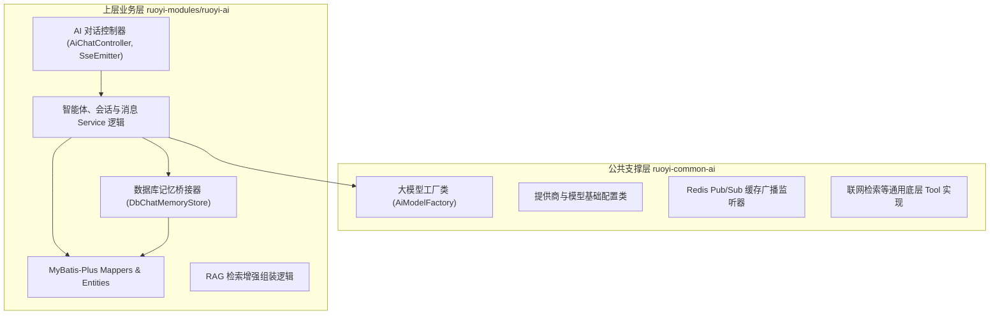
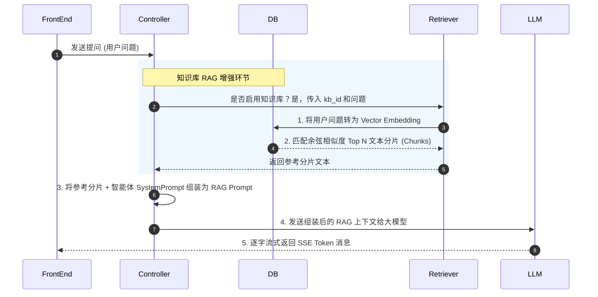

# LangChain4j 动态集成与大模型配置管理设计文档

本文件用于记录和规划接下来要实现的 **LangChain4j 动态集成与大模型数据库管理配置** 功能。随着需求的不断细化，我们将持续更新并完善该文档。

---

## 1. 业务目标与场景

目前 `ruoyi-ai` 模块中的 LangChain4j 集成处于静态配置状态（通过代码或配置文件固定 `baseUrl` 和 `apiKey`）。
为了实现多模型灵活切换以及租户/系统级别的动态配置，接下来的开发目标为：
- **模型表管理**：在数据库中新建大模型配置表，用于增删改查大模型的参数（如 `baseurl`、`api_key`、`model_name` 等）。
- **动态实例构建**：系统不再依赖 Spring 容器启动时的单一静态 Model 实例，而是根据业务需要，从数据库读取配置并动态构建 LangChain4j 的 `ChatLanguageModel` 实例。
- **动态切换与调用**：支持在对话时，指定具体的模型配置 ID 来调用相应的大模型服务。

### 1.1 架构层次划分与模块职责划分

为了符合若依（RuoYi）的模块化开发规范以及高内聚、低耦合的设计原则，我们将 AI 相关的功能拆分为**公共基础支撑层（`common`）**与**上层业务应用层（`modules`）**。

#### 1. 架构模块划分图



#### 2. 各模块职责细节与分工

##### A. 公共支撑层 (`ruoyi-common-ai` 依赖模块)
* **定位**：**纯技术性、业务无关、无状态的底层组件**。只负责 SDK 接入与引擎构建。
* **核心内容**：
  1. `AiModelFactory`：核心大模型工厂，基于本地缓存动态构建 `ChatLanguageModel` 和 `StreamingChatLanguageModel` 实例。它不关心消息被谁读取，也不关心消息怎么落库。
  2. 缓存失效与广播同步类：基于 Redis 模板发布订阅机制的集群缓存同步配置和监听类。
  3. 联网搜索或 Python 代码执行沙箱等与具体应用场景无关的通用工具类（`Tools`）。
* **沉淀到 common 的优势**：
  * **全局可复用**：若系统的其他业务微服务模块（如代码生成模块 `ruoyi-gen` 想要调用大模型生成 Java 代码，或者工作流模块想要调用 AI 审查审批条件）需要大模型服务，只需引入 `ruoyi-common-ai` 依赖，即可通过 `AiModelFactory.getModel(configId)` 直接获取客户端实例进行对话，无需关心繁琐的聊天表、会话和前端 SSE 渲染逻辑。

##### B. 业务应用层 (`ruoyi-modules/ruoyi-ai` 模块)
* **定位**：**强依赖具体业务场景、数据持久化和用户体系的业务中心**。
* **核心内容**：
  1. **API 控制器层 (Controller)**：流式响应接口（`SseEmitter`）、Playground 沙箱调试接口、智能体 CRUD 配置接口等。
  2. **核心业务逻辑层 (Service)**：控制智能体的可见范围控制（个人、部门、系统公开）、知识库文档文件的解析及向量化工作流（MyBatis-Plus 对接）、调用 Token 的计费审计日志记录等。
  3. **记忆桥接器 (`DbChatMemoryStore`)**：由于其需要通过 MyBatis-Plus 对 `ai_chat_message` 表进行实时的数据库存取，因此必须定位在业务层。
  4. **数据库实体与映射层 (Mapper & Entity)**：MyBatis-Plus 的 Mapper、XML 以及 DDL 对应的 10 张表实体类。
* **沉淀到 modules 的优势**：
  * 保证了 `common` 模块的干净与通用，避免了 `common` 直接耦合业务表和特定用户认证（如 Sa-Token 的 `LoginHelper`），使得 AI 功能能够独立升级、独立热部署或作为独立微服务发布。

#### 3. 跨模块调用的最佳集成方案

针对“其他模块如何方便地调用 AI 能力”这一分布式微服务架构场景，我们设计了以下两种不同的集成途径，开发团队可根据实际需求选择：

##### 场景 A：其他业务模块仅需要“调用底层大模型进行推理”
* **例如**：代码生成模块（`ruoyi-gen`）希望调用大模型生成 Java 代码，或者工作流模块想让 GPT 翻译一段审批文本。
* **集成方案**：**本地轻量依赖 `ruoyi-common-ai`**。
* **调用姿势**：
  1. 目标模块引入 `ruoyi-common-ai` 的 Maven 依赖。
  2. 直接在代码中注入 `AiModelFactory`，并获取 `ChatLanguageModel` 实例进行调用：
     ```java
     @Autowired
     private AiModelFactory modelFactory;

     public String translate(String text) {
         // 直接从数据库中获取默认模型配置，或传入指定的配置 ID
         ChatLanguageModel model = modelFactory.getModel(1L); 
         return model.chat(String.format("请翻译：%s", text));
     }
     ```
* **优势**：**无 RPC 损耗，调用极度方便**。无需调用远程 HTTP/RPC 接口，在本地进程内直接完成 HTTP 对大模型服务商的交互。

##### 场景 B：其他业务模块需要“与智能体、聊天会话或知识库等业务实体进行深度交互”
* **例如**：工单系统在用户提交工单后，想自动触发某个特定智能体（如“售后智能客服”，`agent_id = 5`）在后台生成一条解答建议，并且这条对话需要记录在用户的会话历史中。
* **集成方案**：**基于若依标准的 Feign Client 远程 RPC 调用**。
* **具体实现步骤**：
  1. **定义 API 接口 (ruoyi-api 模块)**：在 `ruoyi-api-ai` 接口模块中，声明供外部调用的微服务接口：
     ```java
     @FeignClient(contextId = "remoteAiService", value = ServiceNameConstants.AI_SERVICE, fallbackFactory = RemoteAiFallbackFactory.class)
     public interface RemoteAiService {
         
         /**
          * 触发指定智能体的自动回复（带历史记录持久化）
          */
         @PostMapping("/ai/remote/agent/chat")
         R<String> agentChat(@RequestBody RemoteAgentChatDto dto);

         /**
          * 获取智能体基本配置信息
          */
         @GetMapping("/ai/remote/agent/info/{agentId}")
         R<RemoteAgentVo> getAgentInfo(@PathVariable("agentId") Long agentId);
     }
     ```
  2. **服务层接口实现 (ruoyi-modules/ruoyi-ai)**：在业务模块中编写 Controller 实现该接口逻辑。
  3. **客户端模块调用**：工单系统直接依赖 `ruoyi-api-ai`，注入 `RemoteAiService` 即可像调用本地业务一样通过 Feign 完成智能体业务的调用。

---

## 2. 数据库设计（模型配置、提供商与智能体表）

为了更好地支持多模型生态与智能体管理，我们需要设计以下三张表：
1. **模型提供商表 (`ai_model_provider`)**：用于管理基础的 AI 服务厂商，如阿里云百炼、智谱AI、DeepSeek、OpenAI、Ollama 等，统一维护厂商的标识和默认 API 地址。
2. **大模型配置表 (`ai_model_config`)**：用于增删改查具体的大模型配置（如关联提供商、模型别名、特定 API Key、模型名称等）。
3. **智能体表 (`ai_agent`)**：用于保存用户创建的 Agent 智能体，包括智能体的基本信息、系统提示词（System Prompt）、关联的模型配置以及可见性范围（个人、组织、公开）。

### 2.1 模型提供商表 (`ai_model_provider`)

用于统一录入并配置主流大模型提供商，以便分类管理及预设默认参数。

| 字段名 | 物理类型 | 必填 | 描述 | 备注 |
| :--- | :--- | :--- | :--- | :--- |
| `provider_id` | `bigint` | 是 | 主键 ID | 自增/雪花算法 ID |
| `provider_name` | `varchar(100)`| 是 | 提供商名称 | 例：阿里云百炼、智谱AI、DeepSeek、OpenAI |
| `provider_code` | `varchar(50)` | 是 | 提供商唯一标识键 | 例：`aliyun`、`zhipu`、`deepseek`、`openai` |
| `default_base_url`| `varchar(255)`| 否 | 默认 API 接口地址 | 厂商默认公网端点，如 `https://api.deepseek.com/v1` |
| `status` | `char(1)` | 是 | 启用状态 | `0` 正常，`1` 停用 |
| `create_by` | `varchar(64)` | 否 | 创建者 | RuoYi 审计字段 |
| `create_time` | `datetime` | 否 | 创建时间 | RuoYi 审计字段 |
| `update_by` | `varchar(64)` | 否 | 更新者 | RuoYi 审计字段 |
| `update_time` | `datetime` | 否 | 更新时间 | RuoYi 审计字段 |
| `remark` | `varchar(500)`| 否 | 备注 | 额外说明 |

### 2.2 大模型配置表 (`ai_model_config`)

针对具体模型型号进行参数及密钥配置。

| 字段名 | 物理类型 | 必填 | 描述 | 备注 |
| :--- | :--- | :--- | :--- | :--- |
| `model_config_id` | `bigint` | 是 | 主键 ID | 自增/雪花算法 ID |
| `provider_id` | `bigint` | 是 | 提供商 ID | 外键，关联 `ai_model_provider.provider_id` |
| `config_name` | `varchar(100)`| 是 | 配置别名/名称 | 例：阿里通义千问-Flash、OpenAI-GPT4 |
| `model_name` | `varchar(100)`| 是 | 目标模型名称 | 决定传给接口的实际模型名称，如 `qwen-max`，`gpt-4o` |
| `base_url` | `varchar(255)`| 否 | API 接口覆盖地址 | 若为空，则取提供商的 `default_base_url`；也可在此覆盖 |
| `api_key` | `varchar(255)`| 是 | API 密钥 (Script Key) | 需要考虑加密存储 |
| `max_tokens` | `int` | 否 | 最大生成 Token 数 | 默认值或选填 |
| `temperature` | `double` | 否 | 温度参数 (0.0 ~ 2.0) | 控制回答的随机性 |
| `status` | `char(1)` | 是 | 启用状态 | `0` 正常，`1` 停用 |
| `is_default` | `char(1)` | 是 | 是否为默认模型 | `Y` 是，`N` 否 |
| `create_by` | `varchar(64)` | 否 | 创建者 | RuoYi 审计字段 |
| `create_time` | `datetime` | 否 | 创建时间 | RuoYi 审计字段 |
| `update_by` | `varchar(64)` | 否 | 更新者 | RuoYi 审计字段 |
| `update_time` | `datetime` | 否 | 更新时间 | RuoYi 审计字段 |
| `remark` | `varchar(500)`| 否 | 备注 | 额外说明 |

### 2.3 智能体表 (`ai_agent`)

用于保存用户自定义创建的 AI 智能体助理，包括关联的底层大模型配置、设定提示词、所属组织机构以及可见范围。

| 字段名 | 物理类型 | 必填 | 描述 | 备注 |
| :--- | :--- | :--- | :--- | :--- |
| `agent_id` | `bigint` | 是 | 主键 ID | 自增/雪花算法 ID |
| `agent_name` | `varchar(100)`| 是 | 智能体名称 | 例：周报助手、SQL 编写专家 |
| `avatar` | `varchar(255)`| 否 | 智能体头像 | 头像图片 URL 地址 |
| `description` | `varchar(500)`| 否 | 智能体描述简介 | 简要介绍智能体功能 |
| `system_prompt` | `varchar(2000)`| 否 | 系统提示词 (System Prompt) | 预置给大模型的角色设定和约束指令 |
| `model_config_id` | `bigint` | 是 | 关联大模型配置 ID | 外键，关联 `ai_model_config.model_config_id` |
| `kb_enabled` | `char(1)` | 是 | 启用知识库 | `0` 停用，`1` 启用 |
| `kb_id` | `bigint` | 否 | 关联知识库 ID | 关联外部知识库模块主键 |
| `search_enabled` | `char(1)` | 是 | 启用联网检索 | `0` 停用，`1` 启用 |
| `memory_enabled` | `char(1)` | 是 | 启用聊天记忆 | `0` 停用，`1` 启用（不启用则每次对话为纯单次调用） |
| `memory_window` | `int` | 否 | 记忆窗口长度 | 携带的历史上下文轮数（前 N 轮对话） |
| `greeting` | `varchar(500)`| 否 | 问候语 | 会话初次建立时，智能体的主动欢迎/引导语 |
| `preset_questions`| `varchar(1000)`| 否 | 预设问题 | 对话框下方推荐的预设/引导问题，建议使用 JSON 数组格式存储 |
| `scope_type` | `char(1)` | 是 | 可见范围类型 | `1` 个人（仅创建人本人可见）<br>`2` 组织（仅创建人所属部门及子部门可见）<br>`3` 公开（全系统公开可见） |
| `dept_id` | `bigint` | 否 | 所属部门 ID | 关联 RuoYi 的 `sys_dept.dept_id`（用于组织可见范围过滤） |
| `user_id` | `bigint` | 是 | 创建人用户 ID | 关联 RuoYi 的 `sys_user.user_id`（用于判断是否属于个人专有） |
| `status` | `char(1)` | 是 | 启用状态 | `0` 正常，`1` 停用 |
| `create_by` | `varchar(64)` | 否 | 创建者 | RuoYi 审计字段 |
| `create_time` | `datetime` | 否 | 创建时间 | RuoYi 审计字段 |
| `update_by` | `varchar(64)` | 否 | 更新者 | RuoYi 审计字段 |
| `update_time` | `datetime` | 否 | 更新时间 | RuoYi 审计字段 |
| `remark` | `varchar(500)`| 否 | 备注 | 额外说明 |

### 2.4 对话会话表 (`ai_chat_session`)

用于存储用户的聊天会话（类似于 ChatGPT 左侧的对话列表目录），管理会话基本属性。

| 字段名 | 物理类型 | 必填 | 描述 | 备注 |
| :--- | :--- | :--- | :--- | :--- |
| `session_id` | `bigint` | 是 | 主键 ID | 自增/雪花算法 ID |
| `session_name` | `varchar(200)`| 是 | 会话名称 | 默认取首条对话生成，或用户自定义修改 |
| `agent_id` | `bigint` | 是 | 关联智能体 ID | 外键，关联 `ai_agent.agent_id` |
| `user_id` | `bigint` | 是 | 会话所有者 ID | 关联 RuoYi 的 `sys_user.user_id` |
| `status` | `char(1)` | 是 | 会话状态 | `0` 正常，`1` 归档/软删除 |
| `create_time` | `datetime` | 否 | 创建时间 | RuoYi 审计字段 |
| `update_time` | `datetime` | 否 | 更新时间 | RuoYi 审计字段 |

### 2.5 对话消息表 (`ai_chat_message`)

用于存储每次具体的问答明细，既可用于前端展示历史聊天内容，也可用于提取拼装大模型上下文历史。

| 字段名 | 物理类型 | 必填 | 描述 | 备注 |
| :--- | :--- | :--- | :--- | :--- |
| `message_id` | `bigint` | 是 | 主键 ID | 自增/雪花算法 ID |
| `session_id` | `bigint` | 是 | 关联会话 ID | 外键，关联 `ai_chat_session.session_id` |
| `role` | `varchar(20)` | 是 | 角色类型 | `system` (系统提示词)<br>`user` (用户提问)<br>`assistant` (模型回答)<br>`tool` (插件/工具响应) |
| `content` | `text` / `longtext`| 是 | 消息内容 | 用户输入或模型返回的文本 |
| `token_count` | `int` | 否 | Token 消耗数 | 本条消息的 Token 计算估算 |
| `create_dept` | `bigint` | 否 | 创建部门 | RuoYi 审计字段 |
| `create_by` | `bigint` | 否 | 创建者 | RuoYi 审计字段 |
| `create_time` | `datetime` | 否 | 创建时间 | RuoYi 审计字段 |
| `update_by` | `bigint` | 否 | 更新者 | RuoYi 审计字段 |
| `update_time` | `datetime` | 否 | 更新时间 | RuoYi 审计字段 |
| `del_flag` | `char(1)` | 是 | 删除标志 | `0` 代表存在，`1` 代表删除 |

### 2.6 知识库主表 (`ai_knowledge_base`)

存储知识库的基本元数据，对文档包进行高层级的管理。

| 字段名 | 物理类型 | 必填 | 描述 | 备注 |
| :--- | :--- | :--- | :--- | :--- |
| `kb_id` | `bigint` | 是 | 主键 ID | 自增/雪花算法 ID |
| `kb_name` | `varchar(100)`| 是 | 知识库名称 | 例：内部管理制度、产品设计手册 |
| `description` | `varchar(500)`| 否 | 知识库描述 | 简要介绍知识库作用 |
| `embedding_model_id`| `bigint`| 是 | 向量化模型 ID | 关联 `ai_model_config.model_config_id` |
| `status` | `char(1)` | 是 | 启用状态 | `0` 正常，`1` 停用 |
| `create_dept` | `bigint` | 否 | 创建部门 | RuoYi 审计字段 |
| `create_by` | `bigint` | 否 | 创建者 | RuoYi 审计字段 |
| `create_time` | `datetime` | 否 | 创建时间 | RuoYi 审计字段 |
| `update_by` | `bigint` | 否 | 更新者 | RuoYi 审计字段 |
| `update_time` | `datetime` | 否 | 更新时间 | RuoYi 审计字段 |
| `del_flag` | `char(1)` | 是 | 删除标志 | `0` 代表存在，`1` 代表删除 |
| `remark` | `varchar(500)`| 否 | 备注 | 额外说明 |

### 2.7 知识库文档表 (`ai_knowledge_document`)

记录上传的待解析文档及其切片与向量化进度。

| 字段名 | 物理类型 | 必填 | 描述 | 备注 |
| :--- | :--- | :--- | :--- | :--- |
| `doc_id` | `bigint` | 是 | 主键 ID | 自增/雪花算法 ID |
| `kb_id` | `bigint` | 是 | 关联知识库 ID | 外键，关联 `ai_knowledge_base.kb_id` |
| `doc_name` | `varchar(255)`| 是 | 文档名称 | 例：员工手册.pdf |
| `file_path` | `varchar(255)`| 是 | 文件存储路径 | 在 OSS 或服务器的绝对存储地址 |
| `doc_type` | `varchar(20)` | 否 | 文档后缀类型 | 例：`pdf`、`docx`、`txt` |
| `status` | `char(1)` | 是 | 解析状态 | `0` 上传中，`1` 解析中，`2` 解析完成，`3` 解析失败 |
| `create_dept` | `bigint` | 否 | 创建部门 | RuoYi 审计字段 |
| `create_by` | `bigint` | 否 | 创建者 | RuoYi 审计字段 |
| `create_time` | `datetime` | 否 | 创建时间 | RuoYi 审计字段 |
| `update_by` | `bigint` | 否 | 更新者 | RuoYi 审计字段 |
| `update_time` | `datetime` | 否 | 更新时间 | RuoYi 审计字段 |
| `del_flag` | `char(1)` | 是 | 删除标志 | `0` 代表存在，`1` 代表删除 |
| `remark` | `varchar(500)`| 否 | 备注 | 额外说明 |

### 2.8 系统工具插件表 (`ai_tool`)

预定义并声明智能体可以调用的具体功能接口或工具。

| 字段名 | 物理类型 | 必填 | 描述 | 备注 |
| :--- | :--- | :--- | :--- | :--- |
| `tool_id` | `bigint` | 是 | 主键 ID | 自增/雪花算法 ID |
| `tool_name` | `varchar(100)`| 是 | 工具名称 | 例：网页检索、代码沙箱、天气查询 |
| `tool_code` | `varchar(50)` | 是 | 工具唯一标识键 | 例：`web_search`、`python_interpreter` |
| `tool_type` | `char(1)` | 是 | 工具类型 | `1` 系统内置，`2` 自定义 HTTP 请求 |
| `metadata` | `text` | 否 | 入参定义 | 存放参数定义的 JSON Schema，供大模型匹配入参 |
| `status` | `char(1)` | 是 | 启用状态 | `0` 正常，`1` 停用 |
| `create_dept` | `bigint` | 否 | 创建部门 | RuoYi 审计字段 |
| `create_by` | `bigint` | 否 | 创建者 | RuoYi 审计字段 |
| `create_time` | `datetime` | 否 | 创建时间 | RuoYi 审计字段 |
| `update_by` | `bigint` | 否 | 更新者 | RuoYi 审计字段 |
| `update_time` | `datetime` | 否 | 更新时间 | RuoYi 审计字段 |
| `del_flag` | `char(1)` | 是 | 删除标志 | `0` 代表存在，`1` 代表删除 |
| `remark` | `varchar(500)`| 否 | 备注 | 额外说明 |

### 2.9 智能体-工具插件关联表 (`ai_agent_tool`)

多对多关联表，标记各智能体被授权使用的插件列表。

| 字段名 | 物理类型 | 必填 | 描述 | 备注 |
| :--- | :--- | :--- | :--- | :--- |
| `agent_id` | `bigint` | 是 | 关联智能体 ID | 复合主键，外键关联 `ai_agent` |
| `tool_id` | `bigint` | 是 | 关联工具 ID | 复合主键，外键关联 `ai_tool` |

### 2.10 大模型调用审计日志表 (`ai_call_log`)

保存每次大模型 API 交互的统计指标，用于 Token 计费、限流、审计与分析。

| 字段名 | 物理类型 | 必填 | 描述 | 备注 |
| :--- | :--- | :--- | :--- | :--- |
| `log_id` | `bigint` | 是 | 主键 ID | 自增/雪花算法 ID |
| `user_id` | `bigint` | 否 | 用户 ID | 关联 RuoYi 的 `sys_user.user_id` |
| `agent_id` | `bigint` | 否 | 智能体 ID | 关联 `ai_agent.agent_id` |
| `model_config_id`| `bigint`| 否 | 模型配置 ID | 关联 `ai_model_config.model_config_id` |
| `prompt_tokens` | `int` | 否 | 输入消耗 Token | LLM 请求内容 Token 数 |
| `completion_tokens`| `int`| 否 | 输出消耗 Token | LLM 响应内容 Token 数 |
| `total_tokens` | `int` | 否 | 总消耗 Token | 两个消耗数的累加和 |
| `response_time_ms`| `bigint`| 否 | 响应耗时（毫秒） | 记录调用接口等待时间 |
| `status` | `char(1)` | 是 | 调用状态 | `0` 成功，`1` 失败 |
| `error_message` | `text` | 否 | 失败报错详情 | 记录错误栈或报错信息 |
| `create_time` | `datetime` | 否 | 调用时间 | 审计记录创建时间 |

### 2.11 SQL 建表脚本 (DDL)

以下为完整 AI 服务的 MySQL DDL 建表脚本，共包含 10 张数据表（5 张对话核心表 + 5 张功能扩展表）。统一采用 InnoDB 引擎，字符集为 `utf8mb4`，包含全部 RuoYi 系统审计与逻辑删除字段。

```sql
-- ==========================================
-- 核心对话表 (1 ~ 5)
-- ==========================================

-- 1. AI大模型提供商表
CREATE TABLE `ai_model_provider` (
    `provider_id`       bigint(20)      NOT NULL AUTO_INCREMENT    COMMENT '主键 ID',
    `provider_name`     varchar(100)    NOT NULL                   COMMENT '提供商名称',
    `provider_code`     varchar(50)     NOT NULL                   COMMENT '提供商唯一标识键',
    `default_base_url`  varchar(255)    DEFAULT NULL               COMMENT '默认 API 接口地址',
    `status`            char(1)         NOT NULL DEFAULT '0'       COMMENT '启用状态（0正常 1停用）',
    `del_flag`          char(1)         DEFAULT '0'                COMMENT '删除标志（0代表存在 1代表删除）',
    `create_dept`       bigint(20)      DEFAULT NULL               COMMENT '创建部门',
    `create_by`         bigint(20)      DEFAULT NULL               COMMENT '创建者',
    `create_time`       datetime        DEFAULT NULL               COMMENT '创建时间',
    `update_by`         bigint(20)      DEFAULT NULL               COMMENT '更新者',
    `update_time`       datetime        DEFAULT NULL               COMMENT '更新时间',
    `remark`            varchar(500)    DEFAULT NULL               COMMENT '备注',
    PRIMARY KEY (`provider_id`),
    UNIQUE KEY `uk_provider_code` (`provider_code`)
) ENGINE=InnoDB DEFAULT CHARSET=utf8mb4 COMMENT='AI大模型提供商表';

-- 2. AI大模型配置表
CREATE TABLE `ai_model_config` (
    `model_config_id`   bigint(20)      NOT NULL AUTO_INCREMENT    COMMENT '主键 ID',
    `provider_id`       bigint(20)      NOT NULL                   COMMENT '提供商 ID',
    `config_name`       varchar(100)    NOT NULL                   COMMENT '配置别名/名称',
    `model_name`        varchar(100)    NOT NULL                   COMMENT '目标模型名称',
    `base_url`          varchar(255)    DEFAULT NULL               COMMENT 'API 接口覆盖地址',
    `api_key`           varchar(255)    NOT NULL                   COMMENT 'API 密钥 (Script Key)',
    `max_tokens`        int(11)         DEFAULT NULL               COMMENT '最大生成 Token 数',
    `temperature`       double          DEFAULT NULL               COMMENT '温度参数 (0.0 ~ 2.0)',
    `status`            char(1)         NOT NULL DEFAULT '0'       COMMENT '启用状态（0正常 1停用）',
    `is_default`        char(1)         NOT NULL DEFAULT 'N'       COMMENT '是否为默认模型（Y是 N否）',
    `del_flag`          char(1)         DEFAULT '0'                COMMENT '删除标志（0代表存在 1代表删除）',
    `create_dept`       bigint(20)      DEFAULT NULL               COMMENT '创建部门',
    `create_by`         bigint(20)      DEFAULT NULL               COMMENT '创建者',
    `create_time`       datetime        DEFAULT NULL               COMMENT '创建时间',
    `update_by`         bigint(20)      DEFAULT NULL               COMMENT '更新者',
    `update_time`       datetime        DEFAULT NULL               COMMENT '更新时间',
    `remark`            varchar(500)    DEFAULT NULL               COMMENT '备注',
    PRIMARY KEY (`model_config_id`)
) ENGINE=InnoDB DEFAULT CHARSET=utf8mb4 COMMENT='AI大模型配置表';

-- 3. AI智能体表
CREATE TABLE `ai_agent` (
    `agent_id`          bigint(20)      NOT NULL AUTO_INCREMENT    COMMENT '主键 ID',
    `agent_name`        varchar(100)    NOT NULL                   COMMENT '智能体名称',
    `avatar`            varchar(255)    DEFAULT NULL               COMMENT '智能体头像',
    `description`       varchar(500)    DEFAULT NULL               COMMENT '智能体描述简介',
    `system_prompt`     varchar(2000)   DEFAULT NULL               COMMENT '系统提示词 (System Prompt)',
    `model_config_id`   bigint(20)      NOT NULL                   COMMENT '关联大模型配置 ID',
    `kb_enabled`        char(1)         NOT NULL DEFAULT '0'       COMMENT '启用知识库（0停用 1启用）',
    `kb_id`             bigint(20)      DEFAULT NULL               COMMENT '关联知识库 ID',
    `search_enabled`    char(1)         NOT NULL DEFAULT '0'       COMMENT '启用联网检索（0停用 1启用）',
    `memory_enabled`    char(1)         NOT NULL DEFAULT '1'       COMMENT '启用聊天记忆（0停用 1启用）',
    `memory_window`     int(11)         DEFAULT NULL               COMMENT '记忆窗口长度',
    `greeting`          varchar(500)    DEFAULT NULL               COMMENT '问候语',
    `preset_questions`  varchar(1000)   DEFAULT NULL               COMMENT '预设问题',
    `scope_type`        char(1)         NOT NULL DEFAULT '1'       COMMENT '可见范围类型（1个人 2组织 3公开）',
    `dept_id`           bigint(20)      DEFAULT NULL               COMMENT '所属部门 ID',
    `user_id`           bigint(20)      NOT NULL                   COMMENT '创建人用户 ID',
    `status`            char(1)         NOT NULL DEFAULT '0'       COMMENT '启用状态（0正常 1停用）',
    `del_flag`          char(1)         DEFAULT '0'                COMMENT '删除标志（0代表存在 1代表删除）',
    `create_dept`       bigint(20)      DEFAULT NULL               COMMENT '创建部门',
    `create_by`         bigint(20)      DEFAULT NULL               COMMENT '创建者',
    `create_time`       datetime        DEFAULT NULL               COMMENT '创建时间',
    `update_by`         bigint(20)      DEFAULT NULL               COMMENT '更新者',
    `update_time`       datetime        DEFAULT NULL               COMMENT '更新时间',
    `remark`            varchar(500)    DEFAULT NULL               COMMENT '备注',
    PRIMARY KEY (`agent_id`)
) ENGINE=InnoDB DEFAULT CHARSET=utf8mb4 COMMENT='AI智能体表';

-- 4. AI对话会话表
CREATE TABLE `ai_chat_session` (
    `session_id`        bigint(20)      NOT NULL AUTO_INCREMENT    COMMENT '主键 ID',
    `session_name`      varchar(200)    NOT NULL                   COMMENT '会话名称',
    `agent_id`          bigint(20)      NOT NULL                   COMMENT '关联智能体 ID',
    `user_id`           bigint(20)      NOT NULL                   COMMENT '会话所有者 ID',
    `status`            char(1)         NOT NULL DEFAULT '0'       COMMENT '会话状态（0正常 1软删除）',
    `del_flag`          char(1)         DEFAULT '0'                COMMENT '删除标志（0代表存在 1代表删除）',
    `create_dept`       bigint(20)      DEFAULT NULL               COMMENT '创建部门',
    `create_by`         bigint(20)      DEFAULT NULL               COMMENT '创建者',
    `create_time`       datetime        DEFAULT NULL               COMMENT '创建时间',
    `update_by`         bigint(20)      DEFAULT NULL               COMMENT '更新者',
    `update_time`       datetime        DEFAULT NULL               COMMENT '更新时间',
    PRIMARY KEY (`session_id`)
) ENGINE=InnoDB DEFAULT CHARSET=utf8mb4 COMMENT='AI对话会话表';

-- 5. AI对话消息表
CREATE TABLE `ai_chat_message` (
    `message_id`        bigint(20)      NOT NULL AUTO_INCREMENT    COMMENT '主键 ID',
    `session_id`        bigint(20)      NOT NULL                   COMMENT '关联会话 ID',
    `role`              varchar(20)     NOT NULL                   COMMENT '角色类型（system, user, assistant, tool）',
    `content`           longtext        NOT NULL                   COMMENT '消息内容',
    `token_count`       int(11)         DEFAULT NULL               COMMENT 'Token 消耗数',
    `del_flag`          char(1)         DEFAULT '0'                COMMENT '删除标志（0代表存在 1代表删除）',
    `create_dept`       bigint(20)      DEFAULT NULL               COMMENT '创建部门',
    `create_by`         bigint(20)      DEFAULT NULL               COMMENT '创建者',
    `create_time`       datetime        DEFAULT NULL               COMMENT '创建时间',
    `update_by`         bigint(20)      DEFAULT NULL               COMMENT '更新者',
    `update_time`       datetime        DEFAULT NULL               COMMENT '更新时间',
    PRIMARY KEY (`message_id`),
    KEY `idx_session_id` (`session_id`)
) ENGINE=InnoDB DEFAULT CHARSET=utf8mb4 COMMENT='AI对话消息表';


-- ==========================================
-- 扩展功能表 (6 ~ 10)
-- ==========================================

-- 6. AI知识库主表
CREATE TABLE `ai_knowledge_base` (
    `kb_id`              bigint(20)      NOT NULL AUTO_INCREMENT    COMMENT '主键 ID',
    `kb_name`            varchar(100)    NOT NULL                   COMMENT '知识库名称',
    `description`        varchar(500)    DEFAULT NULL               COMMENT '知识库描述',
    `embedding_model_id` bigint(20)      NOT NULL                   COMMENT '向量化模型 ID',
    `status`             char(1)         NOT NULL DEFAULT '0'       COMMENT '启用状态（0正常 1停用）',
    `del_flag`           char(1)         DEFAULT '0'                COMMENT '删除标志（0代表存在 1代表删除）',
    `create_dept`        bigint(20)      DEFAULT NULL               COMMENT '创建部门',
    `create_by`          bigint(20)      DEFAULT NULL               COMMENT '创建者',
    `create_time`        datetime        DEFAULT NULL               COMMENT '创建时间',
    `update_by`          bigint(20)      DEFAULT NULL               COMMENT '更新者',
    `update_time`        datetime        DEFAULT NULL               COMMENT '更新时间',
    `remark`             varchar(500)    DEFAULT NULL               COMMENT '备注',
    PRIMARY KEY (`kb_id`)
) ENGINE=InnoDB DEFAULT CHARSET=utf8mb4 COMMENT='AI知识库主表';

-- 7. AI知识库文档表
CREATE TABLE `ai_knowledge_document` (
    `doc_id`             bigint(20)      NOT NULL AUTO_INCREMENT    COMMENT '主键 ID',
    `kb_id`              bigint(20)      NOT NULL                   COMMENT '关联知识库 ID',
    `doc_name`           varchar(255)    NOT NULL                   COMMENT '文档名称',
    `file_path`          varchar(255)    NOT NULL                   COMMENT '文件存储路径',
    `doc_type`           varchar(20)     DEFAULT NULL               COMMENT '文档后缀类型',
    `status`             char(1)         NOT NULL DEFAULT '0'       COMMENT '解析状态（0上传中 1解析中 2解析完成 3解析失败）',
    `del_flag`           char(1)         DEFAULT '0'                COMMENT '删除标志（0代表存在 1代表删除）',
    `create_dept`        bigint(20)      DEFAULT NULL               COMMENT '创建部门',
    `create_by`          bigint(20)      DEFAULT NULL               COMMENT '创建者',
    `create_time`        datetime        DEFAULT NULL               COMMENT '创建时间',
    `update_by`          bigint(20)      DEFAULT NULL               COMMENT '更新者',
    `update_time`        datetime        DEFAULT NULL               COMMENT '更新时间',
    `remark`             varchar(500)    DEFAULT NULL               COMMENT '备注',
    PRIMARY KEY (`doc_id`),
    KEY `idx_kb_id` (`kb_id`)
) ENGINE=InnoDB DEFAULT CHARSET=utf8mb4 COMMENT='AI知识库文档表';

-- 8. AI系统工具插件表
CREATE TABLE `ai_tool` (
    `tool_id`            bigint(20)      NOT NULL AUTO_INCREMENT    COMMENT '主键 ID',
    `tool_name`          varchar(100)    NOT NULL                   COMMENT '工具名称',
    `tool_code`          varchar(50)     NOT NULL                   COMMENT '工具唯一标识键',
    `tool_type`          char(1)         NOT NULL DEFAULT '1'       COMMENT '工具类型（1系统内置 2自定义HTTP请求）',
    `metadata`           text            DEFAULT NULL               COMMENT '入参定义（JSON Schema）',
    `status`             char(1)         NOT NULL DEFAULT '0'       COMMENT '启用状态（0正常 1停用）',
    `del_flag`           char(1)         DEFAULT '0'                COMMENT '删除标志（0代表存在 1代表删除）',
    `create_dept`        bigint(20)      DEFAULT NULL               COMMENT '创建部门',
    `create_by`          bigint(20)      DEFAULT NULL               COMMENT '创建者',
    `create_time`        datetime        DEFAULT NULL               COMMENT '创建时间',
    `update_by`          bigint(20)      DEFAULT NULL               COMMENT '更新者',
    `update_time`        datetime        DEFAULT NULL               COMMENT '更新时间',
    `remark`             varchar(500)    DEFAULT NULL               COMMENT '备注',
    PRIMARY KEY (`tool_id`),
    UNIQUE KEY `uk_tool_code` (`tool_code`)
) ENGINE=InnoDB DEFAULT CHARSET=utf8mb4 COMMENT='AI系统工具插件表';

-- 9. AI智能体-工具插件关联表
CREATE TABLE `ai_agent_tool` (
    `agent_id`           bigint(20)      NOT NULL                   COMMENT '智能体 ID',
    `tool_id`            bigint(20)      NOT NULL                   COMMENT '工具 ID',
    PRIMARY KEY (`agent_id`, `tool_id`)
) ENGINE=InnoDB DEFAULT CHARSET=utf8mb4 COMMENT='AI智能体-工具插件关联表';

-- 10. AI大模型调用审计日志表
CREATE TABLE `ai_call_log` (
    `log_id`             bigint(20)      NOT NULL AUTO_INCREMENT    COMMENT '主键 ID',
    `user_id`            bigint(20)      DEFAULT NULL               COMMENT '用户 ID',
    `agent_id`           bigint(20)      DEFAULT NULL               COMMENT '智能体 ID',
    `model_config_id`    bigint(20)      DEFAULT NULL               COMMENT '模型配置 ID',
    `prompt_tokens`      int(11)         DEFAULT NULL               COMMENT '输入消耗 Token',
    `completion_tokens`  int(11)         DEFAULT NULL               COMMENT '输出消耗 Token',
    `total_tokens`       int(11)         DEFAULT NULL               COMMENT '总消耗 Token',
    `response_time_ms`   bigint(20)      DEFAULT NULL               COMMENT '响应耗时（毫秒）',
    `status`             char(1)         NOT NULL DEFAULT '0'       COMMENT '调用状态（0成功 1失败）',
    `error_message`      text            DEFAULT NULL               COMMENT '失败报错详情',
    `create_time`        datetime        DEFAULT NULL               COMMENT '调用时间',
    PRIMARY KEY (`log_id`),
    KEY `idx_user_id` (`user_id`),
    KEY `idx_agent_id` (`agent_id`)
) ENGINE=InnoDB DEFAULT CHARSET=utf8mb4 COMMENT='AI大模型调用审计日志表';
```

## 3. 核心后端架构与设计

### 3.1 大模型实例生命周期与缓存管理

#### 3.1.1 动态构建工厂类设计 (`AiModelFactory`)
由于大模型实例不需要每次请求都重复反射构建，需要设计一个基于**缓存**的模型工厂。

##### 建议设计：`AiModelFactory`
- **缓存结构**：使用本地缓存（如 `ConcurrentHashMap` 或 `Guava Cache`）来缓存已构建的 `ChatLanguageModel` 实例，以 `model_config_id` + `update_time` 的哈希值作为 Key。如果后台修改了配置，应及时清理缓存以重新加载。
- **工厂方法**：
  ```java
  public ChatLanguageModel getModel(Long configId) {
      // 1. 从缓存中获取，存在则直接返回
      // 2. 缓存不存在，从数据库联合查询 model_config 与 associated provider
      // 3. 确定最终使用的 baseUrl（如果 config 里的 baseUrl 为空，则采用 provider 的 default_base_url）
      // 4. 根据 provider_code 类型（如 openai, aliyun, zhipu, deepseek 等）选择对应的构建器或 OpenAI 兼容构建器：
      //    String baseUrl = StringUtils.isNotBlank(config.getBaseUrl()) ? config.getBaseUrl() : provider.getDefaultBaseUrl();
      //    OpenAiChatModel.builder()
      //        .baseUrl(baseUrl)
      //        .apiKey(config.getApiKey())
      //        .modelName(config.getModelName())
      //        .temperature(config.getTemperature())
      //        .build();
      // 5. 放入缓存并返回
  }
  ```

#### 3.1.2 业务逻辑流程
1. **后台配置管理**：提供后台管理页面，供管理员录入和修改大模型的 API 信息。
2. **应用调用**：
   - 客户端发送会话请求，带上指定的 `modelConfigId`（若不传则使用默认的 `is_default = 'Y'` 配置）。
   - 服务端通过 `AiModelFactory` 获取对应的 `ChatLanguageModel` 实例。
   - 调用 `model.chat(...)` 执行对话，并返回给用户。

#### 3.1.3 架构决策：启动预加载 vs 运行时懒加载

针对「程序启动时一次性加载」与「实际使用时懒加载并缓存」两种模式的对比分析：

| 维度 | 方案 A：启动时全部预加载 | 方案 B：使用时懒加载 + 本地缓存（推荐） |
| :--- | :--- | :--- |
| **启动耗时** | 随着配置的模型数增多，启动时需要查询数据库并依次构建 HTTP 客户端实例，略微拖慢启动速度。 | 启动时无需处理，启动速度极快。 |
| **内存/资源占用** | 无论模型是否被用户调用，都会在 JVM 内存中维持所有模型的客户端实例及底层的 HTTP 连接池。 | 只有被实际调用的模型才会在内存中创建实例，冷门模型不占用资源。 |
| **配置热更新** | **较复杂**。数据库中的 API Key 或 URL 更新后，需要额外编写“重新加载单个模型”或“清空并重新初始化所有模型”的事件监听代码，否则只能重启系统。 | **极简单**。仅需在更新数据库配置时，清除该模型在 `AiModelFactory` 缓存中的 Key。下次请求时会自动从数据库读取最新配置并重建。 |
| **容错性** | 若某个三方模型配置有误（或 SDK 构造函数有强校验），可能在系统启动阶段抛出异常，影响整个微服务启动。 | 异常只会在该错误模型被调用时触发，不影响微服务本身的生命周期和其他模型的正常运行。 |
| **首包延迟** | 首次请求直接使用已建好的实例，无额外开销。 | 首次请求需要查询一次数据库和调用 `builder.build()`，会有微秒（小于10ms）级别的额外开销，用户无感。 |

##### 最终决策
选择 **方案 B：使用时懒加载 + 本地缓存**。
- **原因**：本项目为业务管理系统，运营过程中管理员会频繁在后台修改 API 密钥、切换模型地址、新增新配置。使用**懒加载+缓存失效机制**（例如更新模型配置后发送 Redis 消息或直接清理本地缓存）能完美支持**热更新**，且在微服务集群环境下极易维护，同时避免了不必要的内存与连接池开销。

#### 3.1.4 缓存失效与热更新机制

为了配合「运行时懒加载 + 本地缓存」方案，我们需要设计合理的缓存管理与更新流程，特别需要兼顾单机与多服务节点集群部署的场景。

##### 1. 本地缓存生命周期与销毁时机
大模型实例（`ChatLanguageModel`）生命周期长，无需频繁销毁，但应有合理的内存淘汰与清理机制：
- **手动销毁**：管理员在后台“修改模型配置”或“删除/禁用模型配置”时，直接触发缓存清理。
- **自动过期（闲置释放）**：为防止长时间未使用的模型实例一直占用 JVM 内存，可配置 Guava/Caffeine 本地缓存的 **时间过期策略**（例如：`expireAfterAccess(2, TimeUnit.HOURS)`），若某个模型配置 2 小时内无任何用户调用，该实例自动从本地缓存中清除，以释放其占用的 HTTP 连接池资源。
- **容量上限淘汰**：配置最大缓存数量限制（例如 `maximumSize(100)`），超出时采用 LRU（最近最少使用）算法淘汰最久未被使用的模型实例。

##### 2. 配置更新时的缓存更新（热更新）流程
当管理员更新模型配置时，如何确保系统立即使用最新配置？我们针对不同部署环境设计了以下两种同步机制：

###### 场景 A：单机版/单节点部署
- **更新流程**：
  1. 管理员在后台保存修改（调用 `aiModelConfigService.updateById(config)`）。
  2. 在服务层更新数据库成功后，直接调用工厂类的失效方法：`AiModelFactory.invalidate(configId)`。
  3. 当下一次用户发起对话请求调用该 `configId` 时，工厂发现本地缓存已失效（Cache Miss），会从数据库重新查询最新配置，并重新使用 `builder.build()` 创建新的 `ChatLanguageModel` 实例并存入缓存。
  4. 旧的模型实例由于不再被引用，将被 JVM 垃圾回收机制（GC）自动回收。

###### 场景 B：集群/分布式多节点部署（分布式环境）
在多节点集群环境下，节点 A 接收到后台修改请求并清理了自己的本地缓存，但节点 B、C 仍在使用旧配置。
由于 RuoYi 框架默认集成了 Redis，我们可以利用 Redis 来进行分布式缓存同步：
- **方案：Redis 发布订阅（Pub/Sub）广播机制**：
  1. **发布更新**：当任意节点修改或删除了 `model_config` 表时，在 Service 层除更新数据库外，使用 Redis 模板向指定频道（Channel）发布一条广播消息：
     ```java
     // 消息内容为更新的模型配置 ID 
     redisTemplate.convertAndSend("ai:model:update", configId);
     ```
  2. **订阅监听**：系统配置一个 Redis 消息监听器（`RedisMessageListenerContainer`），集群中所有节点均订阅 `ai:model:update` 频道。
  3. **接收与清理**：当各个节点接收到更新通知后，在各自 the JVM 进程内执行本地缓存的清理：
     ```java
     @Override
     public void onMessage(Message message, byte[] pattern) {
         Long configId = deserialize(message.getBody());
         AiModelFactory.invalidate(configId);
     }
     ```
  4. **延迟构建**：各个节点在下次接收到用户的对话请求时，发现本地缓存不存在，便自动从数据库中查询最新的配置重新构建实例，实现了集群环境下的实时热更新。

---

### 3.2 对话核心流程与持久化设计

#### 3.2.1 聊天记忆与历史持久化机制 (ChatMemoryStore)
为了将数据库中的 `ai_chat_message` 表与 LangChain4j 的上下文记忆（`ChatMemory`）无缝打通，我们将基于数据库实现自定义的 `ChatMemoryStore`。

##### 1. 概念分工
- **长线历史（UI 展现）**：前端调用 `/ai/chat/session/list` 获取左侧历史列表；调用 `/ai/chat/message/list?sessionId=xxx` 展示具体的历史气泡。这部分由标准的 MyBatis-Plus 业务接口提供。
- **短线记忆（大模型上下文）**：大模型每次提问时，需要附带该会话的「历史上下文」（比如前 N 轮对话）。由 LangChain4j 内部的 `ChatMemory` 组件和自定义的 `ChatMemoryStore` 负责在每次对话时动态存取。

##### 2. 自定义 `DbChatMemoryStore` 实现架构
我们将实现 `dev.langchain4j.store.memory.chat.ChatMemoryStore` 接口，将大模型的会话上下文直接落库：

```java
@Component
public class DbChatMemoryStore implements ChatMemoryStore {

    @Autowired
    private IAiChatMessageService messageService; // 消息数据库操作类

    /**
     * 从数据库中加载当前会话的所有历史消息，供大模型进行上下文理解
     * @param memoryId 传入的会话 ID (session_id)
     */
    @Override
    public List<ChatMessage> getMessages(Object memoryId) {
        Long sessionId = Long.valueOf(memoryId.toString());
        // 1. 查询该 sessionId 下所有正常状态的消息，按时间升序排列
        List<AiChatMessage> dbMessages = messageService.selectListBySessionId(sessionId);
        
        // 2. 将数据库实体转换为 LangChain4j 标准的 ChatMessage 对象（UserMessage, AiMessage, SystemMessage 等）
        return dbMessages.stream().map(msg -> {
            switch (msg.getRole()) {
                case "user":
                    return UserMessage.from(msg.getContent());
                case "assistant":
                    return AiMessage.from(msg.getContent());
                case "system":
                    return SystemMessage.from(msg.getContent());
                // 可扩展 ToolMessage
                default:
                    return UserMessage.from(msg.getContent());
            }
        }).collect(Collectors.toList());
    }

    /**
     * 更新当前会话的上下文消息（LangChain4j 在每次问答后会调用该方法同步最新的上下文）
     * @param memoryId 传入的会话 ID (session_id)
     * @param messages 完整的或新增的上下文列表
     */
    @Override
    public void updateMessages(Object memoryId, List<ChatMessage> messages) {
        Long sessionId = Long.valueOf(memoryId.toString());
        // 1. 获取传入的最新消息（通常大模型发起问答后，会在 messages 列表尾部追加新的 UserMessage 和 AiMessage）
        // 2. 为了高效，可通过对 messages 列表的大小与数据库已有记录数量进行比对，提取出“新增消息”进行单条或批量插入数据库。
        // 3. 例如：只保存新增的 UserMessage 与 AiMessage，将其映射为 role="user"/"assistant" 并写入 ai_chat_message 表。
    }

    /**
     * 删除当前会话的消息记忆
     */
    @Override
    public void deleteMessages(Object memoryId) {
        Long sessionId = Long.valueOf(memoryId.toString());
        // 在数据库中物理删除或软删除该 sessionId 下的所有消息
        messageService.deleteBySessionId(sessionId);
    }
}
```

##### 3. 智能体 System Prompt 注入逻辑
当用户新建一个 Session 时，或者每次发起会话时，`system_prompt`（智能体设定的角色人设）应作为该 Session 的**第一条消息（SystemMessage）**存入数据库中。这样，在 `getMessages` 加载历史上下文时，人设指令就会永远排在历史记录的最前面，确保智能体人设永远生效且不易被遗忘。

#### 3.2.2 API 接口设计与核心交互流程
为确保前后端联调规范，以下定义了对话核心接口设计（以 Spring MVC 的 SSE 流式响应为主）与核心 RAG 检索流程。

##### 1. 核心对话接口协议（流式响应）
* **接口地址**：`POST /ai/chat/send/stream`
* **请求头**：`Content-Type: application/json`，`Accept: text/event-stream`
* **请求参数 (JSON Body)**：
  ```json
  {
    "sessionId": 123456789,
    "message": "你好，请帮我分析一下这份销售数据"
  }
  ```
* **响应格式 (SSE - Server-Sent Events)**：
  前端建立连接后，服务端通过 `SseEmitter` 逐字/逐词推送数据包，前端流式渲染：
  - `data: {"token": "你好", "status": "processing"}`
  - `data: {"token": "！", "status": "processing"}`
  - `data: {"token": "我是", "status": "processing"}`
  - `data: {"status": "completed", "totalTokens": 28}` (结束标志，携带审计消耗数据)

##### 2. 服务端流式对话执行流程与伪代码
对于 Servlet 架构（非 WebFlux 响应式框架），使用 Spring MVC 自带的 `SseEmitter` 配合线程池实现非阻塞异步推送：

```java
@PostMapping(value = "/send/stream", produces = MediaType.TEXT_EVENT_STREAM_VALUE)
public SseEmitter streamChat(@RequestBody ChatRequest request) {
    SseEmitter emitter = new SseEmitter(0L); // 0 代表永不超时，依靠前端主动断开或完成退出
    Long sessionId = request.getSessionId();
    String userMessage = request.getMessage();

    // 异步执行大模型调用
    CompletableFuture.runAsync(() -> {
        try {
            // 1. 获取会话与智能体配置
            AiChatSession session = sessionService.getById(sessionId);
            AiAgent agent = agentService.getById(session.getAgentId());
            
            // 2. 将用户提问持久化落库 (role = "user")
            messageService.saveUserMessage(sessionId, userMessage);
            
            // 3. 构建大模型流式实例 (Caffeine 缓存)
            StreamingChatLanguageModel streamingModel = modelFactory.getStreamingModel(agent.getModelConfigId());
            
            // 4. 初始化/加载上下文记忆
            ChatMemory chatMemory = MessageWindowChatMemory.builder()
                .chatMemoryStore(dbChatMemoryStore)
                .id(sessionId)
                .maxMessages(agent.getMemoryWindow() != null ? agent.getMemoryWindow() : 10)
                .build();
            
            // 如果是全新会话，需要主动将 Agent 的 system_prompt 和 greeting 注入上下文记忆中
            if (chatMemory.messages().isEmpty() && StringUtils.isNotBlank(agent.getSystemPrompt())) {
                chatMemory.add(SystemMessage.from(agent.getSystemPrompt()));
            }
            
            // 将用户本次提问添加进记忆
            chatMemory.add(UserMessage.from(userMessage));
            
            StringBuilder fullResponse = new StringBuilder();
            
            // 5. 触发大模型流式输出
            streamingModel.chat(chatMemory.messages(), new StreamingResponseHandler<AiMessage>() {
                @Override
                public void onNext(String token) {
                    try {
                        fullResponse.append(token);
                        // 往前端推送 Token
                        emitter.send(SseEmitter.event().data(Map.of("token", token, "status", "processing")));
                    } catch (Exception e) {
                        emitter.completeWithError(e);
                    }
                }

                @Override
                public void onComplete(Response<AiMessage> response) {
                    try {
                        // 保存大模型的完整回复到数据库 (role = "assistant")
                        messageService.saveAssistantMessage(sessionId, fullResponse.toString());
                        
                        // 发送结束标识包
                        emitter.send(SseEmitter.event().data(Map.of("status", "completed")));
                        emitter.complete();
                    } catch (Exception e) {
                        emitter.completeWithError(e);
                    }
                }

                @Override
                public void onError(Throwable error) {
                    emitter.completeWithError(error);
                }
            });
            
        } catch (Exception ex) {
            emitter.completeWithError(ex);
        }
    }, chatThreadPool); // 推荐使用专用线程池处理异步大模型 HTTP 阻塞

    return emitter;
}
```

##### 3. 关联知识库（RAG）流式检索流程
若智能体启用了知识库（`kb_enabled = '1'`），其检索增强的工作流如下：



---

### 3.3 智能体调试沙箱（Playground）设计

在“创建智能体”或“编辑智能体”的页面中，用户在未保存配置（无 `agent_id`）前需要进行实时对话测试。为了支撑这一调试场景，同时避免临时测试数据污染生产数据库，设计以下**无状态调试沙箱（Playground）**方案。

#### 3.3.1 方案选择：无状态前端历史驱动（推荐）
* **核心思路**：前端在编辑器内存中维护一个临时的 `historyMessages` 数组。用户每次在测试窗输入新消息时，前端将**“未保存的智能体配置” + “当前的临时对话历史” + “本次新问题”**作为一个整体 Payload 提交给专用的调试接口。
* **数据库零污染**：后端不读写数据库的 `ai_agent`、`ai_chat_session` 和 `ai_chat_message` 表。大模型需要的上下文完全由前端传入的历史数组提供。

#### 3.3.2 沙箱调试接口协议
* **接口地址**：`POST /ai/chat/sandbox/stream`
* **请求参数 (JSON Body)**：
  ```json
  {
    "agentConfig": {
      "modelConfigId": 1,
      "systemPrompt": "你是一个专业的 Java 架构师...",
      "kbEnabled": "1",
      "kbId": 12,
      "searchEnabled": "0",
      "memoryWindow": 10
    },
    "historyMessages": [
      { "role": "user", "content": "你好" },
      { "role": "assistant", "content": "你好！我是您的 Java 架构师助手，请问有什么可以帮您？" }
    ],
    "newMessage": "Spring Cloud 如何动态刷新配置？"
  }
  ```

#### 3.3.3 后端调试接口流式执行伪代码
后端接收到临时参数后，动态生成 `ChatLanguageModel`，并在内存中组装 `ChatMemory`，不执行任何数据库 Insert/Select 动作：

```java
@PostMapping(value = "/sandbox/stream", produces = MediaType.TEXT_EVENT_STREAM_VALUE)
public SseEmitter sandboxStreamChat(@RequestBody SandboxChatRequest request) {
    SseEmitter emitter = new SseEmitter(0L);
    
    CompletableFuture.runAsync(() -> {
        try {
            SandboxAgentConfig config = request.getAgentConfig();
            List<SandboxMessage> history = request.getHistoryMessages();
            String newMessage = request.getNewMessage();
            
            // 1. 动态构建调试模型实例（依然走 Caffeine 本地缓存）
            StreamingChatLanguageModel streamingModel = modelFactory.getStreamingModel(config.getModelConfigId());
            
            // 2. 内存构建上下文记忆列表 (不需要 DbChatMemoryStore)
            List<ChatMessage> chatMessages = new ArrayList<>();
            
            // 注入未保存的系统人设
            if (StringUtils.isNotBlank(config.getSystemPrompt())) {
                chatMessages.add(SystemMessage.from(config.getSystemPrompt()));
            }
            
            // 注入前端传入的临时历史记录 (控制在记忆窗口长度内)
            int windowSize = config.getMemoryWindow() != null ? config.getMemoryWindow() : 10;
            int startIdx = Math.max(0, history.size() - windowSize);
            for (int i = startIdx; i < history.size(); i++) {
                SandboxMessage msg = history.get(i);
                if ("user".equals(msg.getRole())) {
                    chatMessages.add(UserMessage.from(msg.getContent()));
                } else if ("assistant".equals(msg.getRole())) {
                    chatMessages.add(AiMessage.from(msg.getContent()));
                }
            }
            
            // 如果启用了知识库，在此处执行 RAG 检索并增强最后一条提问
            String finalUserMessage = newMessage;
            if ("1".equals(config.getKbEnabled()) && config.getKbId() != null) {
                String vectorContext = ragRetrieverService.retrieve(config.getKbId(), newMessage);
                finalUserMessage = String.format("请结合以下参考信息回答问题：\n%s\n\n问题：%s", vectorContext, newMessage);
            }
            
            // 注入本次最新问题
            chatMessages.add(UserMessage.from(finalUserMessage));
            
            // 3. 触发流式对话
            streamingModel.chat(chatMessages, new StreamingResponseHandler<AiMessage>() {
                @Override
                public void onNext(String token) {
                    try {
                        emitter.send(SseEmitter.event().data(Map.of("token", token, "status", "processing")));
                    } catch (Exception e) {
                        emitter.completeWithError(e);
                    }
                }

                @Override
                public void onComplete(Response<AiMessage> response) {
                    try {
                        // 发送结束符，不进行任何数据库保存
                        emitter.send(SseEmitter.event().data(Map.of("status", "completed")));
                        emitter.complete();
                    } catch (Exception e) {
                        emitter.completeWithError(e);
                    }
                }

                @Override
                public void onError(Throwable error) {
                    emitter.completeWithError(error);
                }
            });
            
        } catch (Exception ex) {
            emitter.completeWithError(ex);
        }
    }, chatThreadPool);

    return emitter;
}
```

### 3.4 LangChain4j 高级功能编排与技术选型

#### 3.4.1 LangChain4j 声明式编排概念 (AiServices 体系)

针对**“普通的 ChatModel 能否直接挂载知识库、人设、记忆和联网搜索”**这一技术实现原理进行阐述：

#### 1. 原生 `ChatLanguageModel` 的无状态特性
在 LangChain4j 中，原生的 `ChatLanguageModel`（或 `StreamingChatLanguageModel`）是一个**完全无状态的轻量客户端包装**。它只负责最基础的职责：接收一组消息列表 `List<ChatMessage>`，请求大模型接口，返回结果。
* **它自身并不支持**直接在其对象上“挂载”知识库、提示词或联网搜索。它就像一个纯粹的“发动机”。

#### 2. 高级功能的实现基础：AI Services 声明式编排
为了实现这些高级功能，我们需要使用 LangChain4j 提供的核心编排器 —— **`AiServices`**。它可以将“发动机”（`ChatModel`）与各种“配件”（记忆、检索器、工具）组装成一个全功能的“智能体助手（Assistant）”：

1. **系统提示词 (System Prompt) 注入**：
   * 在使用 `AiServices` 时，可以通过在接口方法上加上 `@SystemMessage("人设内容")` 注解，或者在会话初始化时手动将包含系统提示词的 `SystemMessage` 对象插入到 `ChatMemory` 记忆列表的最前端。
2. **聊天记忆 (Chat Memory) 挂载**：
   * 在 `AiServices.builder` 中挂载 `ChatMemoryProvider`（内部接入我们自定义的 `DbChatMemoryStore`）。每次调用时，`AiServices` 会自动从数据库拉取前 N 轮历史，拼接上本次提问后发给模型，并在对话结束后自动将模型回复存入数据库，无需手动写存取代码。
3. **知识库检索 (RAG / ContentRetriever)**：
   * 挂载 `ContentRetriever`（内容检索器）。当提问时，`AiServices` 会自动拦截请求，先去向量数据库检索最相似的文档切片，将切片组装成上下文后，与用户的提问一并提交给大模型。
4. **联网检索与工具 (Tools / Function Calling)**：
   * 声明一个普通的 Java 类，并在其方法上加上 `@Tool("工具描述")`（例如调用 Google 搜索 API 的方法）。将该类对象传入 `AiServices.builder().tools(...)`。
   * 当大模型收到问题（如“今天北京天气如何”）并判断需要联网时，它会返回一个工具调用指令。`AiServices` 会在后台自动执行该 Java 方法获取结果，再自动将结果传回给大模型，最终产出回答。

#### 3. 智能体服务的动态编排代码示例
在业务层，我们可以利用 `AiServices` 编写如下的动态代理组装逻辑：

```java
// 1. 声明智能体统一交互服务接口（支持流式 TokenStream）
public interface AgentAssistant {
    TokenStream chat(String message);
}

// 2. 业务层根据智能体表的开关（ai_agent）动态组装并编译实例
public SseEmitter executeAgentChat(Long sessionId, String userMessage) {
    AiChatSession session = sessionService.getById(sessionId);
    AiAgent agent = agentService.getById(session.getAgentId());

    // 动态构建底层的流式发动机
    StreamingChatLanguageModel streamingModel = modelFactory.getStreamingModel(agent.getModelConfigId());

    // 实例化编排器
    AiServices<AgentAssistant> builder = AiServices.builder(AgentAssistant.class)
        .streamingChatLanguageModel(streamingModel);

    // A. 动态挂载数据库记忆（若启用记忆开关）
    if ("1".equals(agent.getMemoryEnabled())) {
        builder.chatMemoryProvider(id -> MessageWindowChatMemory.builder()
            .chatMemoryStore(dbChatMemoryStore) // 桥接自定义的数据库存储
            .id(id)
            .maxMessages(agent.getMemoryWindow() != null ? agent.getMemoryWindow() : 10)
            .build());
    }

    // B. 动态挂载知识库 RAG 检索器（若启用知识库并且有关联ID）
    if ("1".equals(agent.getKbEnabled()) && agent.getKbId() != null) {
        ContentRetriever retriever = kbRetrieverFactory.createRetriever(agent.getKbId());
        builder.contentRetriever(retriever);
    }

    // C. 动态挂载工具/联网搜索（若启用联网检索或有绑定工具）
    if ("1".equals(agent.getSearchEnabled())) {
        builder.tools(new WebSearchTool()); // 挂载联网搜索工具类
    }

    // 3. 构建出最终的无状态/有状态智能体服务
    AgentAssistant assistant = builder.build();

    // 4. 触发流式对话
    SseEmitter emitter = new SseEmitter(0L);
    TokenStream tokenStream = assistant.chat(userMessage);
    
    tokenStream.onNext(token -> emitter.send(Map.of("token", token)))
               .onComplete(response -> emitter.complete())
               .onError(error -> emitter.completeWithError(error))
               .start();
               
    return emitter;
}
```

#### 3.4.2 两种实现方案对比：声明式 AiServices vs 手动组装 ChatMessage 列表
在使用 LangChain4j 进行智能体开发时，我们可以选择两种实现途径。这两者在底层是完全等价的，因为高阶 API 底层也是转化为 `List<ChatMessage>` 提交给 `ChatLanguageModel` 的。

##### 1. 方案对比与适用场景

| 维度 | 方案 A：声明式 `AiServices` 挂载 | 方案 B：手动组装 `List<ChatMessage>` 传递（推荐） |
| :--- | :--- | :--- |
| **代码量** | 极少。大部分底层编排被框架屏蔽。 | 较多。需要自己编写 SQL 查询、历史轮数截断、RAG 文本拼装逻辑。 |
| **透明度与可控性**| **较低（黑盒）**。开发人员很难直观看到最后发给大模型的完整 Prompt 结构，调试或输出日志较麻烦。 | **极高（白盒）**。开发人员可以在控制台或日志中 100% 打印出即将提交的消息列表，非常利于问题定位。 |
| **多租户与动态性**| 动态拼装时代码略微冗长（如 3.8 节所示），且在高并发或分布式多集群下可能存在线程安全或生命周期管理隐患。 | **非常天然**。每次请求都是纯无状态的，临时拼好 List 直接调用 `chat(list)` 返回，最适合微服务与多租户隔离。 |
| **数据库与 RAG 结合**| 需要遵照框架规范实现 `ChatMemoryStore`，与自定义的复杂查询（如多表 Join 或分表）结合时灵活性较差。 | **极其灵活**。因为从数据库读出历史记录、格式化、以及向量检索都完全由您用 MyBatis-Plus 或 Spring Data 自主控制。 |
| **工具调用 (Function Calling)**| 非常方便。直接挂载带有 `@Tool` 的类，框架自动执行闭环。 | 较繁琐。需要手动判断大模型返回的 ToolCall、执行工具、再将 ToolMessage 插入列表回传大模型。 |

##### 2. 本项目选型建议
在开发 `ruoyi-ai` 业务模块时，如果不需要极度复杂的 Agent 工具反射链，**推荐使用 方案 B：手动组装 `List<ChatMessage>`**：
* **原因**：这与我们 3.7 节的“调试沙箱”设计是一脉相承的。无论是正式聊天，还是智能体未保存时的沙箱测试，本质上都是：
  1. 组装首条 `SystemMessage`（智能体人设提示词）。
  2. 动态加载最近几轮的 `UserMessage` 和 `AiMessage`（正式聊从数据库查，沙箱测试由前端直接传数组）。
  3. 执行知识库检索，将结果以文本形式和最新问题一起组装成最末端的 `UserMessage`（即 RAG 增强 Prompt）。
  4. 最终形成一个 `List<ChatMessage>` 直接传给 `model.chat(List<ChatMessage>)` 进行流式（SSE）推送。
* 这样做能使“正式聊天”和“测试沙箱”共享同一套底层的 Prompt 拼装服务，代码重用率高，且由于无状态设计，天然避开了多服务节点集群下的内存状态同步难题，利于微服务扩展。

#### 3.4.3 概念澄清：手动编排 ChatModel 与真正 Agent 的区别与联系

##### 1. 核心结论：在 RAG + 记忆 + 人设场景下，完全没有区别
如果您的业务需求只是实现 **“拥有系统设定人设（System Prompt）”**、**“携带上下文对话历史（Memory）”** 以及 **“检索外挂知识库文档（RAG）”** 的智能体应用（例如 ChatGPT 中用户自定义创建的 GPTs 聊天助手）：
* **手动拼接 `List<ChatMessage>` 调 Raw ChatModel** 与 **直接使用高级 `Agent` / `AiServices` 框架** 在表现效果和技术结果上 **没有任何区别**。
* 它们向大模型发送的 API payload 是完全一致的。这种手动拼接的方式，可以被称作是一个 **“轻量级单会话智能体（RAG Agent）”**。

##### 2. 本质区别：自主决策循环（Reasoning & Act Loop）
在人工智能领域，一个真正意义上的“智能体（Agent）”通常需要具备 **“自主决策/规划/调用工具（ReAct）”** 的闭环能力。区别在于：
* **手动编排的 RAG 聊天流（无自主决策）**：
  * 执行过程是**线性的、确定性的**。
  * 用户输入问题 -> 后端强行调用向量检索 -> 强行拼入 Prompt -> 发给 LLM -> 返回结果。大模型没有选择不检索知识库或选择调用其他工具的权利。
* **真正的 Tool Agent（有自主决策）**：
  * 执行过程是**非线性的、循环决策的**。
  * 用户输入问题 -> 发送给 LLM -> 大模型进行推理（Reasoning），决定下一步行动（Action） -> 决定调用“查询数据库工具”或“联网搜索工具” -> 后端执行对应工具并返回结果（Observation） -> 再次发送给 LLM -> 大模型决定是继续调用下一个工具，还是直接产出最终回答。
  * 这个**思考-行动-观察-决策**的闭环过程由框架或后端代码循环控制。

##### 3. 手动模式下如何支持真正的 Tool Agent？
在手动模式下，如果要实现真正的 Tool 调用，代码逻辑将变得繁琐。因为您需要手动解析大模型返回的 `ToolExecutionRequest`（工具执行请求），执行本地 Java 方法，然后把返回的 `ToolExecutionResultMessage` 插入到 `List<ChatMessage>` 中再次发给大模型，直到大模型不再返回工具调用请求为止。这正是 `AiServices` 或 `LangChain4j` 的 Agent 工具链在底层为我们省去的工作。

##### 4. 开发总结
* 对于 **90% 的普通 AI 业务对话、专属角色助理、文档客服（RAG）**：手动组装 `ChatMessage` 列表已经**完全等效于 Agent**，且代码更加透明、易控、安全。
* 对于 **需要大模型自主规划任务、自主选择十几个不同 API 进行多轮调用的复杂 Agent**：才需要引入 LangChain4j 的 `AiServices.builder().tools(...)` 或更高级的 Agent 编排框架（如 LangGraph4j / Semantic Kernel）。

---

### 3.5 性能与资费优化 (Prompt Cache)

#### 3.5.1 SystemMessage 对话机制与 Prompt 缓存优化

针对**“每次问答都加上 SystemMessage 行不行？如果 SystemMessage 不变，是否会有缓存命中从而降低费用与延迟？”**的技术细节进行阐述：

#### 1. 结论：必须每次都带上，且完全可以享受 Prompt 缓存优化
* **行不行**：**完全行，且必须这样做**。
* **原因**：大模型 API（包括 OpenAI、阿里云百炼通义千问、DeepSeek 等）是**无状态（Stateless）**的。如果您在第二轮或以后的对话中不带上 `SystemMessage`（系统人设提示词），大模型就会**彻底忘记**之前的智能体设定、扮演的角色以及回复约束条件。
* **因此，每一轮对话拼接发送给大模型的 `List<ChatMessage>` 中，`SystemMessage` 必须作为第 1 条消息发送**。

#### 2. Prompt 缓存（Prompt Caching / Prefix Caching）机制
现代主流的 LLM API（如阿里云百炼 Qwen、DeepSeek-V3/R1、Anthropic Claude）都支持 **Prompt 缓存（前缀缓存）** 技术。其工作原理如下：

* **缓存命中条件**：当请求的 Prompt 前缀（从第 1 个 Token 开始的连续文本）与之前请求的缓存完全吻合，且超过服务商设定的最小长度（例如百炼通常自动识别 1024 Token 以上的长 Prompt，DeepSeek 则对 64 Token 以上即开始计算缓存）时，就会命中缓存。
* **缓存命中的优势**：
  1. **降低费用**：命中的 Token 通常会享受极高的折扣价（例如百炼和 DeepSeek 针对缓存命中的 Prompt 费用最高可**优惠 50% ~ 90%**）。
  2. **降低首字延迟 (TTFT)**：因为省去了大模型重新对这部分 Prompt 进行预处理（Prefill）的计算时间，首字响应时间（Time to First Token）能从数秒下降至几毫秒。

#### 3. 多轮对话中的“滑动缓存”优化
在多轮对话中，大模型 API 不仅能缓存静态的 `SystemMessage`（人设），还能沿着历史记录自动向前滚动缓存：

```
第一轮对话发送：[SystemMessage] + [UserMessage 1] 
             --> (百炼/DeepSeek 缓存此部分)

第二轮对话发送：[SystemMessage] + [UserMessage 1] + [AiMessage 1] + [UserMessage 2]
             --> 前缀 [SystemMessage] + [UserMessage 1] + [AiMessage 1] 直接命中缓存！
             --> 仅需对新增的 [UserMessage 2] 进行 Prefill 编码，并继续写入缓存供第三轮使用。
```

#### 4. 优化建议与注意事项
为了最大化榨干 Prompt 缓存的性能并降低资费，建议遵循以下设计原则：
1. **SystemMessage 保持静态**：
   * 不要将动态变量（如 `当前系统时间`、`随机数`、`当前用户名`）拼入 `SystemMessage`。如果必须使用动态变量，可以将其放入 `UserMessage` 的开头，保证 `SystemMessage` 的内容 100% 相同以维持缓存。
2. **知识库 RAG 上下文拼装顺序**：
   * 如果使用了知识库检索（RAG），检索出的参考文档段落是动态变化的，建议将其拼接在 `UserMessage` 中或者放置在静态 `SystemMessage` 之后。保持最顶部的 `SystemMessage` 纯净静态。
3. **保持对话结构一致性**：
   * 在使用 LangChain4j 的 `ChatMemory` 时，确保每次交互都以完全一致的顺序传递消息列表：`[SystemMessage, UserMessage 1, AiMessage 1, UserMessage 2...]`。

---

## 4. 后续待完善与讨论的细化需求

为了使后续集成更加稳健，我们需要在后续的对接中逐步探讨并明确以下内容：
1. **密钥安全性**：`api_key`（即 Script Key）是否需要在数据库中做对称加密（如 AES）存储，以防数据库被拖库导致 API 额度被盗刷？
2. **超时时间与降级策略**：不同大模型的响应速度差异很大，是否需要在 `ai_model_config` 表中增加单独的超时配置项？对于高频超时是否支持配置备用大模型进行自动熔断与降级？
3. **模型连接测试与健康度监控**：在后台保存模型配置时，提供一个“测试连接/测试调用”的按钮，方便管理员验证填写的参数（API Key、Base URL）是否正确。同时，系统可以通过定时任务进行健康度探测，对异常停用的模型自动告警。
4. **敏感词与内容合规性审计**：在企业级对话生产中，是否需要对用户输入的 Prompt 和大模型输出的内容进行敏感词拦截审计？

