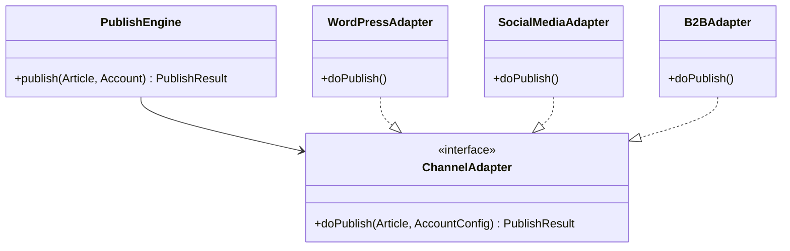

# GEO 智能管理系统 —— 一键宣发矩阵设计说明书

本模块是文章的发布通道与流量入口，负责将生成好的优化稿件分发至企业独立官网、各大主流自媒体账号、B2B 商贸平台及第三方新闻媒体，并对收录和索引状态进行闭环监控。

---

## 1. ⚙️ 功能详细说明

### 1.1 官网 SEO 卫士 (独立站发布)
* **功能描述**：支持对接企业基于 WordPress、Hexo、FastAPI 或自定义开发的官方独立网站。一键同步文章，自动更新网站的 `sitemap.xml`，并调用搜索引擎接口加速页面收录。

### 1.2 矩阵号掌舵人 (自媒体分发)
* **功能描述**：绑定并托管企业的自媒体矩阵（如微信公众号、百家号、今日头条、小红书）。支持在后台多账号一键群发或定时群发。

### 1.3 B2B 商贸阵地 (商贸发布)
* **功能描述**：对接国内外的黄页与商贸门户网（如黄页88、慧聪网等），批量发布产品信息与采购信息，占领传统商业采购的尾部流量。

### 1.4 垂直媒体直通与大 V 联盟
* **功能描述**：管理第三方合作的新闻通稿发布接口，向各大门户网站（网易、新浪等）或高权重行业博主投稿，换取高权重的外部链接（Backlinks），作为大模型引用的信任基础。

---

## 2. 🛠️ 技术实现方案

由于宣发平台繁多，后端接口形态各异，系统采用**适配器设计模式 (Adapter Pattern)** 来设计宣发驱动引擎：



### 2.1 独立站 SEO 收录提交与 AI 爬虫抓取加速
* **REST API 提交**：对接 WordPress XML-RPC 或 REST API，或者使用 Webhook 触发前端静态页面重新构建（如 Gatsby / Next.js Vercel 部署）。
* **收录加速提交 (Indexing APIs)**：
  * 对接 **Google Indexing API**（主要针对 JobPosting/BroadcastEvents 类型，可通过站长平台接口绕过）。
  * 对接 **Bing IndexNow API**：一旦有新文章发布，立刻向其 API 端点发送最新的 URL 列表，加速 Bing (GPT-Search 基础数据源) 的收录。
* **AI 爬虫抓取优化**：在发布的网页中，系统会自动将【品牌知识库】中的事实转为 **JSON-LD 格式的 Schema.org 结构化标记**，格式如下：
  ```html
  <script type="application/ld+json">
  {
    "@context": "https://schema.org",
    "@type": "Product",
    "name": "高精度数控机床",
    "brand": "麦当劳",
    "description": "本产品具有..."
  }
  </script>
  ```
  这使大模型爬虫（如 GPT-Bot、ClaudeBot）在爬取网页时能够以 100% 的准确度直接获取产品参数，免去了大模型的非结构化解析损耗，大幅提高被引用概率。

### 2.2 矩阵号免授权群发实现 (针对限制 API 的平台)
对于无公开 API 或限制个人账号发帖的平台，系统提供两种集成模式：
1. **官方 OAuth 授权通道**：针对微信公众号、百家号等支持开发者 API 的平台，通过标准的 OAuth 2.0 协议进行接入发布。
2. **模拟登录浏览器插件辅助模式（半自动）**：提供浏览器助手插件，将稿件一键同步至小红书等平台的前端编辑器，由人工进行二次核对确认后点击发布。

---

## 3. 💾 数据库表设计 (DDL)

### 3.1 宣发渠道账号表 (`geo_publish_account`)
```sql
CREATE TABLE `geo_publish_account` (
  `account_id` bigint(20) NOT NULL AUTO_INCREMENT COMMENT '账号ID',
  `platform` varchar(50) NOT NULL COMMENT '渠道平台类型（wordpress/wechat/b2b/media）',
  `account_name` varchar(150) NOT NULL COMMENT '账号自定义名称/备注',
  `domain_url` varchar(255) DEFAULT NULL COMMENT '网站域名（独立站适用，如 https://mycorp.com）',
  `auth_config` text NOT NULL COMMENT '认证配置信息，JSON加密存储（如 APIKey, Token, XML-RPC密码）',
  `status` char(1) DEFAULT '0' COMMENT '账号可用状态（0正常 1失效/失效需重连）',
  `create_dept`      bigint(20)                       COMMENT '创建部门',
  `create_by`        bigint(20)                       COMMENT '创建者',
  `create_time`      datetime                         COMMENT '创建时间',
  `update_by`        bigint(20)                       COMMENT '更新者',
  `update_time`      datetime                         COMMENT '更新时间',
  `del_flag`         char(1)          DEFAULT '0'     COMMENT '删除标志（0代表存在 1代表删除）',
  PRIMARY KEY (`account_id`),
  KEY `idx_platform` (`platform`)
) ENGINE=InnoDB DEFAULT CHARSET=utf8mb4 COMMENT='宣发矩阵账号配置表';
```

### 3.2 宣发日志与收录监测表 (`geo_publish_log`)
```sql
CREATE TABLE `geo_publish_log` (
  `log_id` bigint(20) NOT NULL AUTO_INCREMENT COMMENT '宣发日志ID',
  `article_id` bigint(20) NOT NULL COMMENT '关联的文章ID',
  `account_id` bigint(20) NOT NULL COMMENT '关联的账号ID',
  `published_url` varchar(500) DEFAULT NULL COMMENT '发布成功后的目标文章URL',
  `status` char(1) DEFAULT '0' COMMENT '发布状态（0等待中 1成功 2失败）',
  `error_msg` varchar(500) DEFAULT NULL COMMENT '错误信息反馈',
  `is_indexed` char(1) DEFAULT '0' COMMENT '搜索引擎/大语言模型是否已收录该网页（0否 1是）',
  `index_check_time` datetime DEFAULT NULL COMMENT '最近一次进行收录检测的时间',
  `create_dept`      bigint(20)                       COMMENT '创建部门',
  `create_by`        bigint(20)                       COMMENT '创建者',
  `create_time`      datetime                         COMMENT '创建时间',
  `update_by`        bigint(20)                       COMMENT '更新者',
  `update_time`      datetime                         COMMENT '更新时间',
  `del_flag`         char(1)          DEFAULT '0'     COMMENT '删除标志（0代表存在 1代表删除）',
  PRIMARY KEY (`log_id`),
  KEY `idx_article_id` (`article_id`),
  KEY `idx_account_id` (`account_id`),
  KEY `idx_is_indexed` (`is_indexed`)
) ENGINE=InnoDB DEFAULT CHARSET=utf8mb4 COMMENT='文章宣发与收录监控日志表';
```
