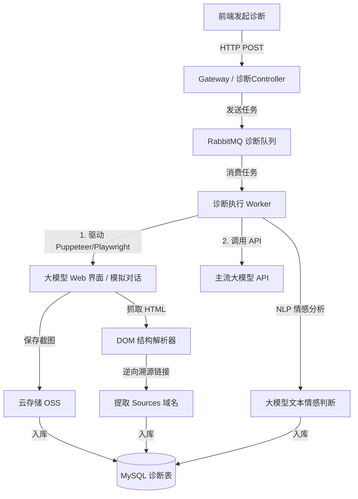

# GEO 智能管理系统 —— GEO 诊断中心设计说明书

本模块是系统的效果评估与监测舱，负责发起 AI 曝光监测任务，采集各大语言模型（LLM）的真实回答，并对品牌提及、来源引用、情感极性及流量报表进行分析与可视化展示。

---

## 1. ⚙️ 功能详细说明

### 1.1 曝光监测
* **用户路径**：用户选择诊断的大模型平台（可多选，如 ChatGPT, Gemini, Claude, 文心一言等），输入需要体检的核心产品/品牌词（如“麦当劳”）以及行业对比词或关键词（如“哪家汉堡最好吃”），点击“发起诊断”。
* **后台处理**：系统将任务放入消息队列，调用后台的 AI 模拟查询组件。
* **业务产出**：输出诊断报告，包含在该关键词提问下，品牌是否被大模型提及（提及率）、提及的排位、大模型给出的态度（情感极性），以及引用的外部源站链接。

### 1.2 竞品分析
* **用户路径**：用户输入核心品牌（如“麦当劳”），配置需要对比的竞品品牌列表（多选/输入，如“肯德基”、“汉堡王”、“德克士”），输入诊断关键词，点击“发起诊断”。
* **后台处理**：与曝光监测任务一致送入队列消费。但在解析大模型回答时，除了匹配核心品牌，也对竞品列表中的品牌进行规则/语义匹配，记录竞品被提及状态、位置、情感态度。
* **业务产出**：生成竞品分析对比看板，展示品牌与竞品之间的 **声量份额 (SoV - Share of Voice)** 比例图、平均推荐排名对比、以及情感极性对比柱状图。

### 1.3 诊断快照 (快照追踪)
* **用户路径**：用户在诊断结果中点击“查看快照”，或者在“诊断快照”中根据日期、关键词、品牌筛选历史截图。
* **业务产出**：直观展示发起诊断当时，大模型回答结果 of 完整网页长截图（带时间戳水印），作为品牌上榜和被提及的真实司法级凭证，供结案汇报使用。

### 1.4 诊断历史
* **用户路径**：展示历史发起的诊断任务列表，支持查看任务状态（排队中、诊断中、已完成、失败）。
* **业务产出**：支持对同一关键词在不同时间点（如每周、每月）的诊断数据进行纵向对比，拉出品牌能见度的成长曲线。

### 1.5 收录报表

* **用户路径**：以图形大屏（Echarts）展示系统级汇总报表。
* **业务产出**：
  * 大模型提及率占比饼图（例如：当前品牌在 ChatGPT 提及率 60%，Gemini 提及率 40%）。
  * 品牌在各大模型的引用来源域名 Top 10（告知用户哪些源网站贡献了最多的 AI 流量）。
  * 文章发布后的收录率与大模型抓取趋势图。

---

## 2. 🛠️ 技术实现方案



### 2.1 模拟检索与截图实现
* **核心组件**：采用 **Playwright / Puppeteer** 无头浏览器集群。
* **规避反爬**：配置 `stealth.min.js` 绕过各大模型的 Bot 检测，模拟真实人工的打字输入提问和等待响应。
* **截图处理**：待对话页面加载完毕且 AI 停止输出（检测停止符或 DOM 变化）后，执行 `page.screenshot({ fullPage: true })`，生成包含时间戳的水印图，上传至腾讯云/阿里云 OSS。

### 2.2 逆向引用来源提取与 NLP 情感分析
* **引用链接提取**：针对带有 Citation 功能的引擎（如 Perplexity, ChatGPT Search, Gemini），通过 DOM 选择器（例如 `a.citation` 或特定卡片节点）提取其引用的 href 原始链接，并过滤出主域名。
* **提及与情感极性判断**：使用中轻量级大模型（如 GPT-3.5-Turbo 或 DeepSeek-Chat）对抓取下来的回答文本进行二次语义结构化解析：
  * **Prompt 设计**：
    ```text
    你是一个专业的数据分析助手。请分析以下大模型对提问的回答文本：
    回答文本：【{response_text}】
    目标品牌：【{brand_name}】
    任务：
    1. 判断文本中是否明确提及了目标品牌（1为提及，0为未提及）。
    2. 判断文本对该品牌的主观态度倾向（positive/negative/neutral）。
    请以 JSON 格式输出，格式为：{"is_mentioned": 1, "sentiment": "positive"}。不要返回任何其他解释。
    ```

---

## 3. 💾 数据库表设计 (DDL)

### 3.1 诊断任务表 (`geo_diagnostic_task`)
```sql
CREATE TABLE `geo_diagnostic_task` (
  `task_id` bigint(20) NOT NULL AUTO_INCREMENT COMMENT '任务ID',
  `keyword` varchar(200) NOT NULL COMMENT '体检/诊断关键词',
  `brand_name` varchar(100) NOT NULL COMMENT '目标品牌/企业名称',
  `competitors` varchar(500) DEFAULT NULL COMMENT '需要对比的竞品品牌列表，JSON数组格式，如 ["肯德基", "汉堡王"]',
  `platforms` varchar(500) NOT NULL COMMENT '诊断大模型平台列表，JSON数组格式，如 ["openai", "gemini"]',
  `status` char(1) DEFAULT '0' COMMENT '任务状态（0等待中 1诊断中 2成功 3失败）',
  `remark` varchar(500) DEFAULT NULL COMMENT '备注/失败原因',
  `create_dept`      bigint(20)                       COMMENT '创建部门',
  `create_by`        bigint(20)                       COMMENT '创建者',
  `create_time`      datetime                         COMMENT '创建时间',
  `update_by`        bigint(20)                       COMMENT '更新者',
  `update_time`      datetime                         COMMENT '更新时间',
  `del_flag`         char(1)          DEFAULT '0'     COMMENT '删除标志（0代表存在 1代表删除）',
  PRIMARY KEY (`task_id`),
  KEY `idx_keyword_brand` (`keyword`, `brand_name`)
) ENGINE=InnoDB DEFAULT CHARSET=utf8mb4 COMMENT='GEO诊断任务主表';
```

### 3.2 诊断结果明细表 (`geo_diagnostic_detail`)
```sql
CREATE TABLE `geo_diagnostic_detail` (
  `detail_id` bigint(20) NOT NULL AUTO_INCREMENT COMMENT '明细ID',
  `task_id` bigint(20) NOT NULL COMMENT '关联的任务ID',
  `platform` varchar(50) NOT NULL COMMENT '诊断平台（openai/gemini/claude/yiyan 等）',
  `response_text` text COMMENT '大模型回答的原文内容',
  `is_cited` char(1) DEFAULT '0' COMMENT '品牌是否被提及引用（0否 1是）',
  `citation_rank` int(3) DEFAULT NULL COMMENT '品牌在回答中的提及排位（如第1个推荐）',
  `sources` text COMMENT '解析出的源站引用链接列表，JSON格式，如 ["site1.com", "site2.com"]',
  `sentiment` varchar(20) DEFAULT 'neutral' COMMENT '情感极性（positive褒义 neutral中性 negative贬义）',
  `screenshot_url` varchar(500) DEFAULT NULL COMMENT '大模型回答的快照截图云存储地址',
  `competitor_results` text COMMENT '竞品诊断分析结果，JSON数组格式，如 [{"brand":"肯德基","is_cited":"1","citation_rank":2,"sentiment":"neutral"}]',
  `create_dept`      bigint(20)                       COMMENT '创建部门',
  `create_by`        bigint(20)                       COMMENT '创建者',
  `create_time`      datetime                         COMMENT '创建时间',
  `update_by`        bigint(20)                       COMMENT '更新者',
  `update_time`      datetime                         COMMENT '更新时间',
  `del_flag`         char(1)          DEFAULT '0'     COMMENT '删除标志（0代表存在 1代表删除）',
  PRIMARY KEY (`detail_id`),
  KEY `idx_task_id` (`task_id`),
  KEY `idx_platform_cited` (`platform`, `is_cited`)
) ENGINE=InnoDB DEFAULT CHARSET=utf8mb4 COMMENT='GEO诊断结果明细表';
```
