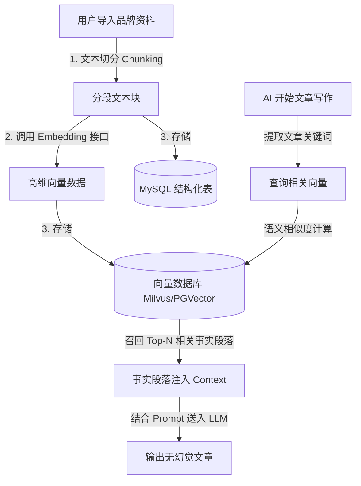

# GEO 智能管理系统 —— 品牌配置设计说明书

本模块负责企业私有化事实资产（知识库、图片库）的配置与存储，是 AI 进行“无幻觉写作”与“精准配图”的核心数据基石。

---

## 1. ⚙️ 功能详细说明

### 1.1 事实库 (事实数据库)
* **用户路径**：用户可以手动录入、或者批量导入（TXT/PDF/Word/Markdown 格式）关于企业、品牌、产品或服务的具体介绍。支持“问答形式 (Q&A)”和“长文段落形式”。
* **主要目的**：作为 AI 写作时的事实依据。AI 会强制从本知识库中提取数据进行填充，拒绝空洞幻想，保障 B2B 场景下的参数和信息准确度。

### 1.2 官网同步 (智能自学习同步)
* **用户路径**：用户添加需要学习的企业官网 URL（如 `https://example.com/about`），配置同步周期（手动/每日/每周/每月）以及页面过滤规则。
* **主要目的**：定时抓取官网更新内容，自动提取核心产品事实并注入事实库，使 AI 写作始终能够基于最新、最权威的企业状态，避免人工反复上传文档的繁琐。

### 1.3 媒体资产 (视觉物料库)
* **用户路径**：上传企业的 Logo、工厂照、产品实物照等高清图片。
* **参数配置**：用户需要为每张图配置“Alt描述标签”和“契合关键词关联”（如图片“机床正面.jpg”关联词“高精度数控机床”）。
* **主要目的**：在 AI 批量写作排版时，系统会基于关联算法，自动在文章的合适段落处插入这些真实的品牌配图，形成图文并茂、且带 SEO 标签的发布原稿。

---

## 2. 🛠️ 技术实现方案

本系统采用主流的 **RAG (检索增强生成)** 架构，将静态企业数据转化为 AI 可动态调用的事实背景：



### 2.1 文本向量化 (RAG) 实现细节
* **分块策略**：采用字符重叠滑动窗口机制。长文按 300~500 字符进行切分，重叠度（Overlap）设为 50 字符，以防止边界语义丢失。
* **向量化接口**：默认调用 `text-embedding-3-small` 或本地部署的 `bge-large-zh-v1.5` 模型，生成 1024 维度的特征向量。
* **向量存储**：由于后端为 Ruoyi 框架，为减少中间件复杂度，在早期阶段推荐使用 **PostgreSQL PGVector 扩展** 或者 **MySQL 辅以轻量向量检索库 (Faiss)** 进行混合检索；在中大型部署中对接 **Milvus / Pinecone**。

### 2.2 自动智能配图算法
* **配图时机**：文章生成后，进入后处理阶段（Post-processing）。
* **匹配算法**：
  1. 系统提取文章各段落的 TF-IDF 关键词；
  2. 与【媒体资产】中上传图片关联的“契合关键词”进行文本相似度（Simhash 或 Cosine 相似度）比对；
  3. 当某段落的相关性得分超过设定阈值（如 0.75），且当前段落未进行过配图，则在该段落下方插入带有 `` 的图片占位符。

---

## 3. 💾 数据库表设计 (DDL)

### 3.1 事实库表 (`geo_brand_knowledge`)
```sql
CREATE TABLE `geo_brand_knowledge` (
  `knowledge_id` bigint(20) NOT NULL AUTO_INCREMENT COMMENT '知识点ID',
  `title` varchar(200) NOT NULL COMMENT '知识点标题（或Q&A的问题）',
  `content_type` char(1) DEFAULT '1' COMMENT '内容格式（1长文本段落 2问答Q&A 3文件导入）',
  `content_body` text NOT NULL COMMENT '详细事实内容（或Q&A的回答）',
  `vector_mapped_id` varchar(100) DEFAULT NULL COMMENT '映射在向量数据库中的向量唯一Key',
  `status` char(1) DEFAULT '0' COMMENT '状态（0正常 1停用）',
  `create_dept`      bigint(20)                       COMMENT '创建部门',
  `create_by`        bigint(20)                       COMMENT '创建者',
  `create_time`      datetime                         COMMENT '创建时间',
  `update_by`        bigint(20)                       COMMENT '更新者',
  `update_time`      datetime                         COMMENT '更新时间',
  `del_flag`         char(1)          DEFAULT '0'     COMMENT '删除标志（0代表存在 1代表删除）',
  PRIMARY KEY (`knowledge_id`),
  KEY `idx_content_type` (`content_type`)
) ENGINE=InnoDB DEFAULT CHARSET=utf8mb4 COMMENT='企业品牌事实知识库表';
```

### 3.2 媒体资产表 (`geo_brand_gallery`)
```sql
CREATE TABLE `geo_brand_gallery` (
  `image_id` bigint(20) NOT NULL AUTO_INCREMENT COMMENT '图片ID',
  `image_name` varchar(150) NOT NULL COMMENT '图片显示名称',
  `image_url` varchar(500) NOT NULL COMMENT '图片存储OSS地址',
  `alt_text` varchar(200) DEFAULT NULL COMMENT '图片SEO ALT标签描述内容',
  `relation_tags` varchar(500) DEFAULT NULL COMMENT '关联关键词标签，JSON数组格式，如 ["数控机床","精密加工"]',
  `status` char(1) DEFAULT '0' COMMENT '状态（0可用 1停用）',
  `create_dept`      bigint(20)                       COMMENT '创建部门',
  `create_by`        bigint(20)                       COMMENT '创建者',
  `create_time`      datetime                         COMMENT '创建时间',
  `update_by`        bigint(20)                       COMMENT '更新者',
  `update_time`      datetime                         COMMENT '更新时间',
  `del_flag`         char(1)          DEFAULT '0'     COMMENT '删除标志（0代表存在 1代表删除）',
  PRIMARY KEY (`image_id`)
) ENGINE=InnoDB DEFAULT CHARSET=utf8mb4 COMMENT='品牌视觉配图物料库表';

### 3.3 官网同步配置表 (`geo_brand_sync_config`)
```sql
CREATE TABLE `geo_brand_sync_config` (
  `config_id` bigint(20) NOT NULL AUTO_INCREMENT COMMENT '配置ID',
  `sync_url` varchar(500) NOT NULL COMMENT '需要同步的官网URL',
  `sync_interval` varchar(50) DEFAULT 'daily' COMMENT '同步周期（daily每日 weekly每周 monthly每月 manual手动）',
  `status` char(1) DEFAULT '0' COMMENT '配置状态（0启用 1停用）',
  `last_sync_time` datetime DEFAULT NULL COMMENT '最近一次同步时间',
  `create_dept`      bigint(20)                       COMMENT '创建部门',
  `create_by`        bigint(20)                       COMMENT '创建者',
  `create_time`      datetime                         COMMENT '创建时间',
  `update_by`        bigint(20)                       COMMENT '更新者',
  `update_time`      datetime                         COMMENT '更新时间',
  `del_flag`         char(1)          DEFAULT '0'     COMMENT '删除标志（0代表存在 1代表删除）',
  PRIMARY KEY (`config_id`)
) ENGINE=InnoDB DEFAULT CHARSET=utf8mb4 COMMENT='企业官网同步配置表';
```

### 3.4 官网同步日志表 (`geo_brand_sync_log`)
```sql
CREATE TABLE `geo_brand_sync_log` (
  `log_id` bigint(20) NOT NULL AUTO_INCREMENT COMMENT '日志ID',
  `config_id` bigint(20) NOT NULL COMMENT '关联的同步配置ID',
  `status` char(1) DEFAULT '0' COMMENT '同步结果（0成功 1失败）',
  `page_count` int(11) DEFAULT '0' COMMENT '抓取成功页面数',
  `chunk_count` int(11) DEFAULT '0' COMMENT '新生成的向量分块数',
  `error_msg` varchar(500) DEFAULT NULL COMMENT '同步失败异常信息',
  `create_time`      datetime                         COMMENT '开始/执行时间',
  PRIMARY KEY (`log_id`),
  KEY `idx_config_id` (`config_id`)
) ENGINE=InnoDB DEFAULT CHARSET=utf8mb4 COMMENT='官网自学习同步日志表';
```
```
