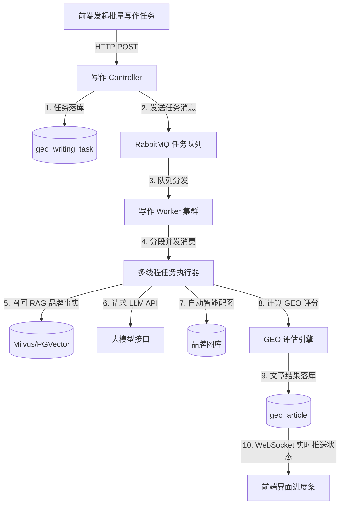

# GEO 智能管理系统 —— 内容工作坊设计说明书

本模块是系统的生产核心，负责调用词库与品牌事实资产，驱动 AI 进行标题优化、指令式单篇写作、批量异步写作以及针对全网网页链接的爆文复刻。

---

## 1. ⚙️ 功能详细说明

### 1.1 标题生成 (标题 SEO 优化)
* **功能描述**：输入写作主旨，AI 自动根据搜索引擎的收录喜好以及大模型的抓取关键词倾向，生成 10~20 个创意标题。

### 1.2 Prompt 模板 (Prompt 模板)
* **功能描述**：支持配置公共与个人 Prompt 指令库（如“专业新闻通稿写作”、“小红书爆款图文模板”）。指令中可留出占位变量（如 `{product_name}`），便于复用。

### 1.3 分类管理
* **功能描述**：多级树状文章分类，方便按项目、部门或目标宣发渠道对生成稿件进行管理。

### 1.4 批量写作 (核心高并发区)
* **功能描述**：当需要大量生产铺内容时，用户可选择一个指令模板，并一次性勾选 100 个关键词，发起“批量写作任务”。系统在后台多线程异步执行，用户在任务列表中查看排队与生成进度，生成失败的任务支持一键重试。

### 1.5 稿件管理 (文章列表)
* **功能描述**：生成的稿件集中陈列。支持在线富文本编辑二次修改、一键复制纯文本/HTML、查看文章的 **GEO 评分（如结构化得分、事实核对结果）**。

### 1.6 宣发日历
* **功能描述**：以日历网格形式（月/周视图）展现已排期和已发布的稿件计划。用户可以通过拖拽日历中的卡片来自由调整各渠道文章的发布时间，支持一键点击日历网格某天直接发起定时发布或自动智写排期。

### 1.7 流量裂变舱 (爆文复刻)
* **功能描述**：
  * **单链接复刻**：提取指定爆文 URL 的结构和用词偏好，用 AI 重塑生成高权重原创稿件。
  * **批量复刻**：批量上传多条爆文链接或主题，矩阵化衍生裂变大批量伪原创文案。

---

## 2. 🛠️ 技术实现方案

### 2.1 高并发异步写作架构
为了防止大量 AI 写作请求导致请求超时，系统设计了基于消息队列（RabbitMQ/RocketMQ）和线程池的异步量产引擎：



### 2.2 爆文复刻抓取与解析方案
* **网页内容抓取**：对于没有防爬检测的普通网页，使用 **Jsoup** 或 **HttpClient** 快速拉取网页 DOM。对于带有防爬协议的复杂页面，调用 **Playwright** 获取渲染后的 HTML，使用 `Readability.js` 算法智能提取出文章正文，滤除广告和侧边栏。
* **风格逆向分析 Prompt**：
  ```text
  分析以下文章的正文，解码其流量基因：
  文章正文：【{source_text}】
  任务：
  1. 梳理其文章的大纲结构（Outline）。
  2. 提取其写作语调（如幽默、严谨、客观、感性）。
  3. 提炼其核心关键词。
  请严格输出以下格式的 JSON 字符串：
  {"outline": "段落1大意..", "tone": "严谨", "keywords": ["词1", "词2"]}
  ```

### 2.3 GEO 评分算法设计 (GEO Scorer)
大模型在索引网页时，更偏爱“结构化”、“可信度高”的内容。评分卡标准为：
1. **结构化分 (40%)**：检测是否包含 Markdown 表格 (`<table>`)、无序列表 (`<ul>`/`<li>`)、多级标题 (`h2/h3`)。各包含一项得 10 分。
2. **数据事实分 (30%)**：检测是否包含具体百分比、数字统计数据或年份。
3. **品牌密度分 (30%)**：检测【事实库】中的事实词汇出现频次，过低无法曝光，过高会判定为垃圾信息，最佳区间为 2%~5% 密度。

---

## 3. 💾 数据库表设计 (DDL)

### 3.1 批量写作任务表 (`geo_writing_task`)
```sql
CREATE TABLE `geo_writing_task` (
  `task_id` bigint(20) NOT NULL AUTO_INCREMENT COMMENT '任务ID',
  `template_id` bigint(20) DEFAULT NULL COMMENT '使用的Prompt模板ID',
  `category_id` bigint(20) DEFAULT NULL COMMENT '目标文章分类ID',
  `keywords_list` text NOT NULL COMMENT '勾选的关键词ID或文本列表，JSON数组格式',
  `total_count` int(11) DEFAULT '0' COMMENT '需要生成的文章总数',
  `success_count` int(11) DEFAULT '0' COMMENT '生成成功的文章总数',
  `failed_count` int(11) DEFAULT '0' COMMENT '生成失败的文章总数',
  `status` char(1) DEFAULT '0' COMMENT '任务状态（0等待中 1写作中 2已完成 3部分成功部分失败）',
  `create_dept`      bigint(20)                       COMMENT '创建部门',
  `create_by`        bigint(20)                       COMMENT '创建者',
  `create_time`      datetime                         COMMENT '创建时间',
  `update_by`        bigint(20)                       COMMENT '更新者',
  `update_time`      datetime                         COMMENT '更新时间',
  `del_flag`         char(1)          DEFAULT '0'     COMMENT '删除标志（0代表存在 1代表删除）',
  PRIMARY KEY (`task_id`)
) ENGINE=InnoDB DEFAULT CHARSET=utf8mb4 COMMENT='批量创作任务表';
```

### 3.2 文章稿件表 (`geo_article`)
```sql
CREATE TABLE `geo_article` (
  `article_id` bigint(20) NOT NULL AUTO_INCREMENT COMMENT '文章ID',
  `task_id` bigint(20) DEFAULT NULL COMMENT '关联批量任务ID（为NULL代表单篇写作）',
  `category_id` bigint(20) DEFAULT NULL COMMENT '所属分类ID',
  `title` varchar(250) NOT NULL COMMENT '文章标题',
  `content` mediumtext NOT NULL COMMENT '文章正文（HTML/Markdown格式）',
  `geo_score` int(3) DEFAULT '0' COMMENT 'GEO 优化评分（0-100分）',
  `fact_check_result` text COMMENT '事实校验结果（记录疑似幻觉或不符事实的段落，JSON格式）',
  `status` char(1) DEFAULT '0' COMMENT '状态（0草稿 1审核中 2已分发 3已废弃）',
  `create_dept`      bigint(20)                       COMMENT '创建部门',
  `create_by`        bigint(20)                       COMMENT '创建者',
  `create_time`      datetime                         COMMENT '创建时间',
  `update_by`        bigint(20)                       COMMENT '更新者',
  `update_time`      datetime                         COMMENT '更新时间',
  `del_flag`         char(1)          DEFAULT '0'     COMMENT '删除标志（0代表存在 1代表删除）',
  PRIMARY KEY (`article_id`),
  KEY `idx_task_id` (`task_id`),
  KEY `idx_category_id` (`category_id`),
  FULLTEXT KEY `ft_content` (`title`,`content`) COMMENT '全文索引用于站内检索'
) ENGINE=InnoDB DEFAULT CHARSET=utf8mb4 COMMENT='生成的文章稿件表';
```

### 3.3 爆文复刻任务表 (`geo_replication_task`)
```sql
CREATE TABLE `geo_replication_task` (
  `replication_id` bigint(20) NOT NULL AUTO_INCREMENT COMMENT '复刻ID',
  `source_url` varchar(500) NOT NULL COMMENT '被复刻的源爆文URL',
  `source_title` varchar(250) DEFAULT NULL COMMENT '源爆文标题',
  `replicated_article_id` bigint(20) DEFAULT NULL COMMENT '复刻生成的新文章ID',
  `status` char(1) DEFAULT '0' COMMENT '状态（0爬取中 1解码分析中 2复刻中 3成功 4失败）',
  `create_dept`      bigint(20)                       COMMENT '创建部门',
  `create_by`        bigint(20)                       COMMENT '创建者',
  `create_time`      datetime                         COMMENT '创建时间',
  `update_by`        bigint(20)                       COMMENT '更新者',
  `update_time`      datetime                         COMMENT '更新时间',
  `del_flag`         char(1)          DEFAULT '0'     COMMENT '删除标志（0代表存在 1代表删除）',
  PRIMARY KEY (`replication_id`),
  KEY `idx_replicated_art` (`replicated_article_id`)
) ENGINE=InnoDB DEFAULT CHARSET=utf8mb4 COMMENT='网页爆文复刻记录表';
```
