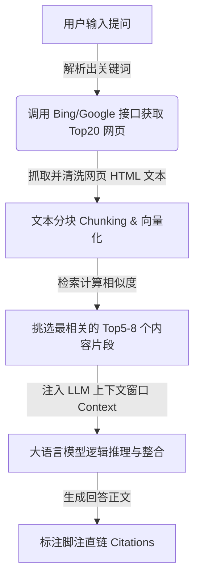

# GEO (生成式引擎优化) 收录与推荐优化指南 (Playbook)

生成式引擎优化（GEO）是指通过优化网站内容，使其更容易被大语言模型搜索引擎（如 Perplexity, ChatGPT Search, 豆包, 秘塔 AI 搜索）在回答用户提问时进行检索、采纳并作为**脚注直链（Citations）**推荐给用户的过程。

以下为大模型检索与收录的核心机制、优化维度及落地优先级。

---

## 🛠️ 一、 大模型搜索收录的底层逻辑 (RAG机制)

大模型搜索引擎（以 Perplexity 为代表）在回答用户问题时，主要遵循 **RAG (检索增强生成)** 流程：

**核心结论**：想被大模型收录，必须同时满足**“传统搜索引擎搜得到（能被 Bing/Google 抓取并排在前面）”**与**“大模型读得懂、喜欢读（文本容易被分块提取并被大模型采信）”**两个条件。

---

## 🚀 二、 GEO 优化维度与优先级排行榜

根据对大模型收录偏好（如 Perplexity 论文及 GEO 学术研究报告）的分析，我们将优化手段按 **优先级（P0 至 P3）** 进行排列：

### 🥇 P0：基建可见度 (Crawlability & SEO Basics) —— 决定“大模型能否看到你”
> [!IMPORTANT]
> 这是 GEO 优化的前提。如果这一步没做好，后续的内容优化均无意义。

1.  **解除爬虫屏蔽 (Allow Robots)**：
    *   检查网站的 `robots.txt`，确保允许大模型的爬虫（如 `GPTBot`, `PerplexityBot`, `ClaudeBot`, `Google-Extended`, `Bingbot`）访问并抓取内容。
2.  **搜索引擎收录 (Search Engine Indexing)**：
    *   大模型搜索绝大多数依赖 Bing/Google 的 API 返回网页。因此，网站必须做好 Bing/Google 的传统 SEO。
    *   *行动点*：配置站点地图（Sitemap.xml），使用 **Indexing API** 主动向搜索引擎推送新网页链接（对应本系统 `5.1 官网SEO同步` 功能）。
3.  **秒开与清洁的 HTML**：
    *   大模型在抓取网页时，遇到加载过慢、有复杂 JS 渲染阻碍的页面往往会直接放弃。
    *   *行动点*：使用服务端渲染（SSR）或静态生成（SSG），确保网页纯文本能被几百毫秒内解析。

---

### 🥈 P1：信息结构与格式 (Information Structuring) —— 决定“大模型是否喜欢你”
> [!TIP]
> 大模型天生喜欢“结构清晰”、“论据充足”的内容。通过格式调整，可以大幅提升内容被大模型从 Top20 网页片段中采信并标注为脚注的概率。

1.  **Q&A 问答化结构 (Question & Answer Format)**：
    *   *为什么*：大模型用户提问是口语化的（如：“*低代码平台有什么安全风险？*”）。
    *   *行动点*：在文章中，直接将用户可能的提问设为二级标题（H2/H3），并在下方第一段给予 **精准、不兜圈子** 的回答（大模型非常喜欢直接切片这段话）。
2.  **多用无序列表与对比表格 (Lists & Tables)**：
    *   *为什么*：LLM 在总结回答时，极度偏爱提取网页里的表格和列表，因为结构化数据推理成本最低。
    *   *行动点*：在核心段落后，使用 Markdown 格式整理对比表格或步骤列表。
3.  **引用事实数据与统计指标 (Statistics & Citations)**：
    *   *为什么*：GEO 研究表明，包含真实数据（如：“*优化后页面首字节时间缩短了 43%*”）的内容，被 LLM 选为论据的概率提升了 **30% 以上**。
    *   *行动点*：文章中必须包含具体数据，并适度引用行业报告、标准规范，提升权威度。

---

### 🥉 P2：语义关联度 (Semantic & Entity Density) —— 决定“大模型是否觉得你专业”
> [!NOTE]
> 大模型是基于“语义相似度（Vector Similarity）”进行检索的，而非简单的关键词硬匹配。

1.  **共现词与行业实体词覆盖 (LSI Keywords)**：
    *   *行动点*：在文章中除了出现“核心词”，还必须广泛分布行业相关的专业实体词。例如：写“低代码系统”，文章中应自然出现“可视化表单、工作流引擎、私有化部署、API集成、数据模型”等关联实体。这能增加大模型的向量检索相关性得分。
2.  **学术与客观语气 (Academic/Objective Tone)**：
    *   *为什么*：大模型（特别是商业搜索引擎如 Perplexity）有非常严格的“去广告、去情绪化”过滤机制。
    *   *行动点*：写作时采用第三人称客观叙述，少用夸张的修辞手法（如“全网第一”、“震撼震撼”），多用客观评测和中立陈述句。

---

### 🏅 P3：外链与站外提及 (Off-site Brand Authority) —— 决定“大模型是否默认偏爱你”
> [!NOTE]
> 大模型在无网络检索（或混合检索）时，会优先吐出在其训练语料（基座参数）中经常出现的品牌名。

1.  **第三方高权重平台提及 (Off-site Mentions)**：
    *   在大模型训练的清洗语料中，Wikipedia、知乎、Github、Reddit、新浪新闻等权重极高。
    *   *行动点*：通过行业媒体发布通稿（对应系统 `5.4` 功能）、在知乎等高权重社区维护品牌问答，让大模型在参数预训练阶段就建立对您品牌的“认知”。

---

## 📊 三、 GEO 优化落地核对表 (GEO Score Checklist)

当我们在系统的“稿件管理中心”审核一篇文章时，系统内置的 **GEO 评分算法**（对应表中的 `geo_score`）主要根据以下清单对文章进行自动打分和纠偏：

| 检查大类 | 细分检查项 | 优化建议 | 权重分配 |
| :--- | :--- | :--- | :---: |
| **可读性** | 句子长度控制 | 避免单句字数超过 50 字，大模型切片易断句错误 | 10% |
| **结构化** | H2/H3 标题是否为问题句 | 确保标题符合用户真实检索提问习惯 | 20% |
| **数据力** | 是否包含百分比/具体数据 | 每篇文章建议至少包含 2-3 个真实数据点 | 25% |
| **排版** | 是否包含列表或 Markdown 表格 | 至少包含一个对比表格或步骤列表 | 15% |
| **语义** | 核心词与行业共现词密度 | 核心关键词在首段与尾段自然出现，共现词覆盖率 > 60% | 20% |
| **语气** | 中立客观度检测 | 剔除带有明显广告色彩的极端形容词 | 10% |
