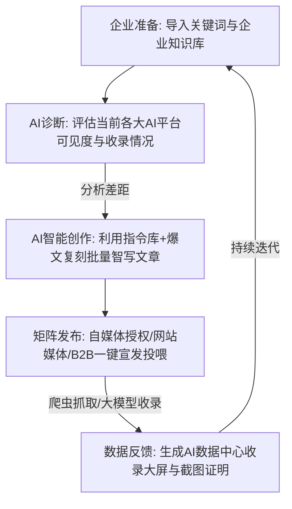

# GEO 智能管理系统 —— 参考平台（geo.b7u.cn）业务逻辑梳理及系统映射指南

本指南对参考平台（`geo.b7u.cn`）的用户控制台、核心业务流程、表单字段及底层逻辑进行了深度剖析，并将其直接映射到本项目的后端微服务 `ulpon-geo` 开发模块中，指导后期的表结构设计、API 接口编写与业务逻辑实现。

---

## 1. 🌐 业务定位与核心业务流

参考平台是一个**生成式引擎优化（Generative Engine Optimization, GEO）管理系统**。其核心理念是帮助品牌方优化其在各大 AI 大模型搜索平台（如 DeepSeek, 豆包, 腾讯元宝等）上的**可见度（Visibility）**、**提及率（Mention Rate）**和**源站引用率（Citation Rate）**。

### 🔄 核心业务闭环流


---

## 2. 🗂️ 核心功能模块详细逻辑梳理

平台前端基于多标签页（Multipletab）架构加载各子页面。以下为各功能模块的详细业务逻辑与入参字段分析：

### 2.1 AI 诊断模块 (AI Visibility Diagnostic)
这是评估与监测的核心入口，用于体检品牌在主流大模型中的曝光率。
*   **AI可见度诊断 (`/user/analyze/add`)**：
    *   **业务逻辑**：用户指定需要查询的 AI 大模型，输入目标品牌和对应的行业核心词，选择是否需要大模型在分析后输出优化建议。点击后扣除点数，后台异步调用 Playwright 模拟用户向 AI 大模型进行真实提问，解析回答。
    *   **大模型支持**：DeepSeek、豆包、腾讯元宝、通义千问、文心一言、纳米AI、Kimi、智谱清言。
    *   **表单入参字段**：
        *   `platform[]` (Array): 选择的诊断大模型平台（支持多选）。
        *   `brand_name` (String): 品牌名称（如：*小米科技, 小米*，支持逗号分隔多个简称/全程）。
        *   `industry_word` (String): 行业词（如：*喷墨打印机, AI诊断软件*，单次最多3个）。
        *   `need_suggest` (Integer): 是否需要优化建议报告（`0`无需建议，仅可见度报告；`1`需要生成建议报告）。
    *   **系统扣费**：单次创建任务消耗点数/余额（如 3 元/次）。
*   **诊断报告 (`/user/analyze/`)**：
    *   **业务逻辑**：展示所有的历史诊断任务。点击后可以查看各个平台的回答原文、提及倾向（褒义/贬义/中性）、主页来源引用 Top 10、以及大模型网页渲染的长截图快照。

### 2.2 AI 创作准备 (Material Source Center)
此模块为 RAG 知识库与拓词的准备库，解决 AI 写作“幻觉”和“无内容可写”的问题。
*   **企业关键词 (`/user/company_keyword`)**：
    *   **表列字段**：主词、关联问题数量、优化状态（开启/关闭）、创建时间。
*   **写作标题 (`/user/company_question/`)**：
    *   存放生成的文章标题、长尾疑问词，作为智写任务的题目源。
*   **企业知识库 (`/user/user_huaxiang`)**：
    *   **业务逻辑**：支持上传企业资质、产品介绍、Q&A、事实文本。后台执行向量化（Embedding）并存入向量数据库，供创作厂调用作为 RAG 原料。

### 2.3 AI 文章写作与爆文复刻 (AI Writing & Traffic Replication)
*   **AI 写作任务 (`/user/ai_task/`)**：
    *   **业务逻辑**：用户提交任务批量生成文章。可以选择是否“引用知识库”。
    *   **表列字段**：任务名、蒸馏词、创作上限（控制任务运行次数）、已创作数量、引用知识库状态（若引用则显示 `引用知识库`）、错误消息、状态（创作中、创作完成、创作失败）、最新写作时间。
*   **全网爆文复刻 (`/user/weixin_baowen/`)**：
    *   输入微信公众号、小红书等爆文链接，系统解析其大纲和正文结构，结合品牌词“重新洗稿复刻”出一篇全新的品牌宣传稿。

### 2.4 B2B、自媒体一键宣发 (Publishing Matrix)
文章写好后，需要分发到网络上供大模型蜘蛛抓取收录。
*   **个人自媒体授权 (`/user/weixinapp2`)**：
    *   **业务逻辑**：支持微信公众号、今日头条、百家号、知乎、网易号等平台授权。
    *   **核心痛点与解决**：由于自媒体防关联和限流机制，平台提供**全局代理 IP 绑定**与**单账号代理 IP 配置**（格式：`IP:端口:账号:密码`，要求固定静态 HTTP 代理且带宽 >= 5M），保证每个渠道通过独立代理发布，规避封号风险。

### 2.5 AI 收录数据报表 (AI Data Center)
*   **收录拓展查询（带截图）(`/user/shoulu_tuozhan/`)**：
    *   **业务逻辑（核心组合器）**：
        根据 A（前缀/地区）、B（形容词）、C（主词【必填】）、D（目标通义词【必填】）、E（推荐词）、F（疑问词）六个文本框（每行一个）进行**笛卡尔积**碰撞拼装。
        例如：
        *   A: `江西`
        *   B: `专业的`
        *   C: `SEO优化`
        *   D: `公司`
        *   E: `推荐`
        *   F: `哪家好`
        碰撞出的长尾句式：`江西专业的SEO优化公司推荐哪家好`。
    *   **平台选择**：选择要执行查收录的大模型列表（支持多选）。
    *   **操作按钮**：
        1.  `预览全部问题`：JS前端直接计算出拼装的所有长尾句总数并列出。
        2.  `保存词组`：调用接口 `/user/shoulu_tuozhan/save_keyword`。
        3.  `评估查询`：调用 `/user/shoulu_tuozhan/pinggu` 返回预计的问题总数。
        4.  `提交查收录`：调用 `/user/shoulu_tuozhan/shoulu`。后台通过无头浏览器轮询各大模型此长尾词的搜索回答，提取 citation 引用链接，看是否有本企业的发布文章在内，并在完成后将含有提及内容的浏览器截图上传至 Aliyun OSS，以供用户在报表中查看证明。

---

## 3. 🎯 对应本项目 `ulpon-geo` 模块架构的映射设计

基于 Ruoyi 微服务目录规范，对参考平台进行系统级的后端映射与设计补充建议：

```text
ruoyi-modules/ulpon-geo
├── src/main/resources/doc
│   ├── 01_GEO诊断中心设计.md        <--> 对应控制台的 [AI诊断] 模块以及 [收录拓展查询(带截图)]
│   ├── 02_策略词库仓设计.md          <--> 对应控制台的 [企业关键词库] 与 [手动/AI拓词工具]
│   ├── 03_品牌配置仓设计.md          <--> 对应控制台的 [企业画像图库] 与 [企业知识库(RAG)]
│   ├── 04_智能创作厂设计.md          <--> 对应控制台的 [写作指令]、[AI写作任务]、[流量爆文复刻]
│   ├── 05_一键宣发矩阵设计.md        <--> 对应控制台的 [B2B发布]、[网站媒体]、[个人自媒体授权发布]
│   └── 06_账户管理中心设计.md        <--> 对应控制台的 [消耗明细(点数/余额)] 与 [账号权益]
```

### 3.1 数据库映射补充设计说明

#### 1. 收录查询任务表 (`geo_shoulu_task`)
对应 `/user/shoulu_tuozhan` 功能，需保存碰撞公式与选定主词：
```sql
CREATE TABLE `geo_shoulu_task` (
  `id` bigint(20) NOT NULL AUTO_INCREMENT COMMENT '主键ID',
  `company_keyword_id` bigint(20) NOT NULL COMMENT '关联主词ID',
  `area_a` text DEFAULT NULL COMMENT 'A区前缀/地区(一行一个)',
  `area_b` text DEFAULT NULL COMMENT 'B区前缀2/形容词(一行一个)',
  `area_c` text NOT NULL COMMENT 'C区主词(一行一个)',
  `area_d` text NOT NULL COMMENT 'D区目标通义词(一行一个)',
  `area_e` text DEFAULT NULL COMMENT 'E区推荐词(一行一个)',
  `area_f` text DEFAULT NULL COMMENT 'F区疑问词(一行一个)',
  `platforms` varchar(200) NOT NULL COMMENT '平台逗号分隔,如 1,2,3',
  `status` char(1) DEFAULT '0' COMMENT '状态(0待提交 1查询中 2已完成)',
  `create_by` varchar(64) DEFAULT NULL COMMENT '创建者',
  `create_time` datetime DEFAULT NULL COMMENT '创建时间',
  PRIMARY KEY (`id`)
) ENGINE=InnoDB DEFAULT CHARSET=utf8mb4 COMMENT='GEO收录查询拼词任务表';
```

#### 2. 自媒体授权代理 IP 关联配置
对应自媒体账号授权防止同 IP 被拉黑限流的设计：
在自媒体账号关联表（如 `geo_media_account`）中，必须设计 Proxy 代理 IP 相关的物理字段：
```sql
ALTER TABLE `geo_media_account` 
ADD COLUMN `proxy_ip` varchar(100) DEFAULT NULL COMMENT '代理IP端口, 格式 ip:port',
ADD COLUMN `proxy_username` varchar(100) DEFAULT NULL COMMENT '代理鉴权用户名',
ADD COLUMN `proxy_password` varchar(100) DEFAULT NULL COMMENT '代理鉴权密码',
ADD COLUMN `proxy_status` char(1) DEFAULT '0' COMMENT '代理健康状态(0正常 1失效)';
```

---

## 4. 💡 后期开发合理化建议

1.  **AI诊断与收录截图的高并发处理**：
    由于抓取大模型和截图（Playwright）是高延时、重 CPU/IO 的操作，应设计专门的 **Crawler-Worker 节点**。后端 `ulpon-geo` 的 Spring Boot 服务只做接口接收与任务下发（写入 RabbitMQ），单独起若干个 Node.js / Python 容器作为 Worker 去拉取队列执行网页渲染截图，避免 JVM 线程阻塞，保证高可用性。
2.  **RAG 向量化（智能画像）选型**：
    由于若依默认是轻量级框架，在开发“企业知识库”时，不建议自行手写大量向量切片算子。可以借助 Spring AI 或 LangChain4j，连接 PostgreSQL (pgvector) 或 Milvus。本地开发为了便利，建议采用 SQLite + Spring AI 内存向量库，或者是统一接入外部大模型（例如 Milvus Lite / DashScope 向量服务）。
3.  **拼词组合笛卡尔积的前端处理**：
    参考平台在“预览全部问题”时是**完全由前端 JS 计算并展示**的（详见 [`shoulu_tuozhan.html`](file:///C:/Users/zain/.gemini/antigravity/brain/70e69206-7359-4dbc-afc8-da4ec51bb5e7/scratch/shoulu_tuozhan.html#L591-L647) 里的 `generateCombinations` 和 `cartesianProduct`）。我们在开发若依前端时，也应当把笛卡尔积组合预览放在 Vue 页面前端处理，只有在“保存”和“提交诊断”时，才将文本框参数提交给后端接口，从而降低服务器带宽和运算消耗。
